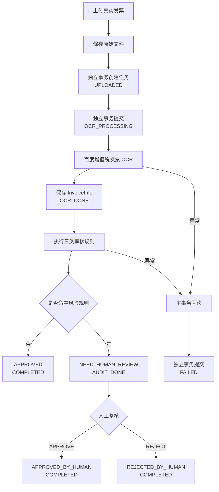
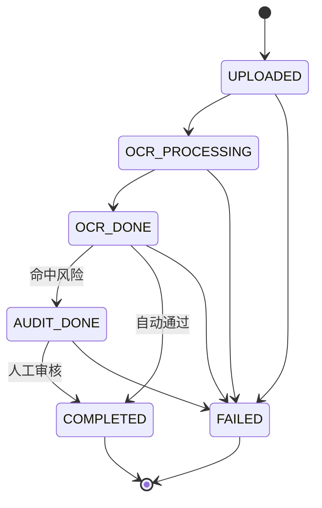
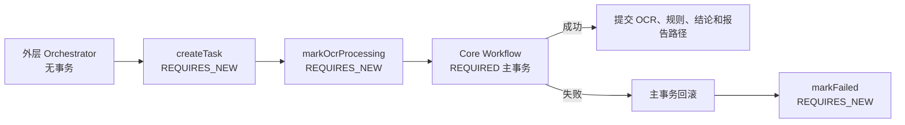
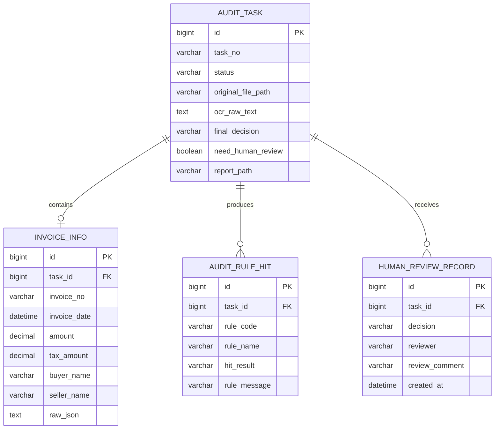

# 智能发票报销审核多 Agent 系统

基于 Spring Boot、MyBatis、MySQL 和百度增值税发票 OCR 构建的发票报销审核后端。

当前项目已经完成传统业务底座、真实 OCR、规则审核、任务状态机、事务边界和人工复核闭环。项目目前处于“可靠的智能审核后端 MVP”阶段，尚未正式接入 LLM、Tool Calling、Supervisor Agent 和 Multi-Agent Graph。

## 1. 当前阶段

截至 2026-08-19，项目已经从普通的发票 CRUD 系统演进为一个状态驱动的审核 Workflow。

| 模块 | 当前状态 | 说明 |
|---|---:|---|
| 文件上传与任务创建 | 已完成 | 文件按日期保存，数据库创建审核任务 |
| 百度真实 OCR | 已完成并验证 | 调用百度增值税发票 OCR，解析并保存真实字段与原始 JSON |
| 自动审核规则 | 已完成并验证 | 必要字段、金额超限、重复发票检测 |
| 审核报告 | 已完成 | 生成 UTF-8 TXT 报告并保存路径 |
| 查询与任务中心 API | 已完成 | 分页、状态筛选、详情、OCR 信息、规则、报告查询 |
| 人工复核 | 已完成并验证 APPROVE | 支持 APPROVE/REJECT，保存审核记录并重新生成报告 |
| 状态机重构 | 代码已完成 | 增加 OCR_PROCESSING、FAILED、自动通过直接 COMPLETED |
| 事务边界重构 | 代码已完成 | 创建任务、OCR_PROCESSING、FAILED 使用独立事务 |
| 状态机完整回归 | 进行中 | 还需验证 REJECT、自动通过、OCR 失败三个场景 |
| 自动化测试 | 尚不完整 | 当前只有 contextLoads，缺少业务和接口测试 |
| Supervisor Agent | 尚未实现 | 已有 Service 可继续封装为 Agent Tools |
| Multi-Agent Graph | 尚未实现 | 需要先完成单 Supervisor + Tools |
| 前端 | 尚未实现 | 当前代码为后端项目 |

按工程范围估算：

- 传统后端业务 MVP：约 85%～90%
- 状态机与事务稳定化：约 80%～85%
- 单 Supervisor + Agent Tools：约 10%
- 完整多 Agent 产品：约 45%～50%

这些百分比用于描述阶段完成度，不代表代码行数。

## 2. 系统现在能做什么

用户上传一张真实发票后，系统可以：

1. 将原始发票保存到本地目录。
2. 创建一条 `audit_task`，初始状态为 `UPLOADED`。
3. 在调用百度 OCR 前，将状态独立提交为 `OCR_PROCESSING`。
4. 调用百度增值税发票 OCR。
5. 解析发票号、日期、金额、税额、购买方、销售方和发票类型。
6. 将结构化字段保存到 `invoice_info`，并保留百度原始 JSON。
7. 执行必要字段、金额超限和重复发票规则。
8. 将命中规则保存到 `audit_rule_hit`。
9. 根据风险决定自动完成或进入人工复核。
10. 生成 TXT 审核报告并保存报告路径。
11. 对风险任务执行人工 APPROVE 或 REJECT。
12. 将人工审核记录保存到 `human_review_record`。
13. 更新最终结论并重新生成最终报告。
14. 如果核心 Workflow 失败，回滚主事务并独立记录 `FAILED`。

## 3. 完整业务流程



### 3.1 无风险发票

```text
UPLOADED
  ↓
OCR_PROCESSING
  ↓
OCR_DONE
  ↓
COMPLETED

finalDecision = APPROVED
needHumanReview = false
```

### 3.2 风险发票

```text
UPLOADED
  ↓
OCR_PROCESSING
  ↓
OCR_DONE
  ↓
AUDIT_DONE

finalDecision = NEED_HUMAN_REVIEW
needHumanReview = true
```

人工复核后：

```text
AUDIT_DONE
  ↓
COMPLETED

finalDecision = APPROVED_BY_HUMAN
或
finalDecision = REJECTED_BY_HUMAN
```

### 3.3 异常流程

```text
OCR_PROCESSING
  ↓
Core Workflow 发生异常
  ↓
Core 主事务回滚
  ↓
REQUIRES_NEW 独立事务
  ↓
FAILED
```

## 4. 状态机

任务状态集中定义在 `AuditTaskStatus`，合法转换由 `AuditTaskStateMachine` 统一检查。



`COMPLETED` 和 `FAILED` 是终态。状态更新 SQL 同时检查任务 ID 和旧状态：

```sql
UPDATE audit_task
SET status = #{targetStatus},
    updated_at = NOW()
WHERE id = #{id}
  AND status = #{currentStatus};
```

如果并发请求已经改变任务状态，更新行数会变成 0，Service 会抛出异常，避免非法覆盖。

## 5. 事务边界

状态机重构的核心不只是增加状态，而是重新划分 Spring Transaction。



### 为什么需要这样拆分

如果创建任务、OCR、规则审核和失败更新全部位于一个大事务中，抛出异常后：

- `InvoiceInfo` 会回滚；
- 规则命中记录会回滚；
- `FAILED` 更新也会回滚；
- 甚至刚创建的 `audit_task` 也可能消失。

现在的实现保证：

- 任务创建后立即真实存在；
- OCR 执行期间可以查询到 `OCR_PROCESSING`；
- Core 失败时业务数据整体回滚；
- 主事务回滚后仍能单独保存 `FAILED`。

## 6. 代码分层

| 层级 | 主要类 | 职责 |
|---|---|---|
| Controller | `InvoiceController` | 接收 HTTP 请求，返回统一响应 |
| Application Service | `AuditTaskServiceImpl` | 查询、详情聚合、人工复核、启动 Workflow |
| Orchestrator | `InvoiceAuditWorkflowServiceImpl` | 保存文件、创建任务、调用 Core、捕获异常 |
| Core Workflow | `InvoiceAuditWorkflowCoreServiceImpl` | OCR、规则、自动决策、报告生成的主事务 |
| Lifecycle | `AuditTaskLifecycleServiceImpl` | 创建任务、状态转换、FAILED 独立事务 |
| State Machine | `AuditTaskStateMachine` | 校验合法状态转换 |
| OCR Adapter | `BaiduOcrServiceImpl` / `MockOcrServiceImpl` | 隔离真实 OCR 与业务流程 |
| Rule Service | `AuditRuleServiceImpl` | 执行确定性审核规则 |
| Report Service | `AuditReportServiceImpl` | 生成和读取审核报告 |
| Persistence | Mapper 接口与 XML | MyBatis 数据持久化 |

## 7. 当前审核规则

### 7.1 必要字段校验

规则代码：`RULE_REQUIRED_FIELD`

检查：

- 发票号码；
- 购买方名称；
- 销售方名称。

任意字段为空即进入人工复核。

### 7.2 金额超限校验

规则代码：`RULE_AMOUNT_LIMIT`

当前阈值：

```text
50000.00 元
```

金额大于阈值时进入人工复核。

### 7.3 重复发票校验

规则代码：`RULE_DUPLICATE_INVOICE`

系统根据真实发票号码查询历史 `invoice_info`，并排除当前任务本身。如果存在相同发票号，则判定为疑似重复报销。

## 8. 已验证的真实结果

当前已经验证：

- 百度真实 OCR 可以返回并解析真实字段；
- 95400 元发票可以命中金额超限规则；
- 同一发票再次上传可以命中重复发票规则；
- 风险任务最终保持 `AUDIT_DONE`；
- 人工 APPROVE 可以将任务更新为 `COMPLETED`；
- 人工结论为 `APPROVED_BY_HUMAN`；
- `needHumanReview` 更新为 `false`；
- 人工审核记录成功写入 `human_review_record`；
- 最终报告能够重新生成并显示人工审核结论；
- 人工审核中途发生数据库异常时，事务能够回滚，补表后可以重新审核。

尚需回归验证：

- 人工 REJECT；
- 未命中规则时自动 `APPROVED + COMPLETED`；
- 百度 OCR 失败时任务保留且状态为 `FAILED`；
- 已完成任务不能再次人工审核；
- 报告生成失败时 Core 事务是否按预期回滚。

## 9. 数据模型



当前数据库表需要手工创建。项目还没有 Flyway 或 Liquibase，因此数据库 Migration 是近期必须补齐的工程能力。

## 10. 技术栈

- Java 17
- Spring Boot 3.5.16
- Spring MVC
- Spring Transaction
- MyBatis 3.0.5
- MySQL
- Maven / Maven Wrapper
- 百度增值税发票 OCR
- Redis 依赖与连接配置（业务暂未使用）

## 11. API

| Method | Path | 作用 |
|---|---|---|
| GET | `/health` | 健康检查 |
| POST | `/api/invoices/upload` | 上传发票并执行完整审核 |
| GET | `/api/invoices/tasks` | 分页查询任务，可按状态筛选 |
| GET | `/api/invoices/tasks/{id}` | 查询任务 |
| GET | `/api/invoices/tasks/{id}/invoice-info` | 查询 OCR 结构化结果 |
| GET | `/api/invoices/tasks/{id}/rule-hits` | 查询规则命中记录 |
| GET | `/api/invoices/tasks/{id}/report` | 查询审核报告 |
| GET | `/api/invoices/tasks/{id}/detail` | 查询完整任务详情 |
| POST | `/api/invoices/tasks/{id}/human-review` | 人工 APPROVE 或 REJECT |

人工审核请求示例：

```json
{
  "decision": "APPROVE",
  "reviewer": "Yuchuan",
  "comment": "Invoice checked and approved"
}
```

## 12. 本地运行

### 12.1 环境要求

- JDK 17
- MySQL
- Maven Wrapper
- 百度 OCR API Key 与 Secret Key
- Redis 可选，当前业务暂未调用

### 12.2 配置环境变量

PowerShell：

```powershell
$env:BAIDU_OCR_API_KEY="你的 API Key"
$env:BAIDU_OCR_SECRET_KEY="你的 Secret Key"
```

不要把真实密钥提交到 Git。

### 12.3 编译与测试

```powershell
.\mvnw.cmd clean compile
.\mvnw.cmd test
```

### 12.4 启动

```powershell
.\mvnw.cmd spring-boot:run
```

健康检查：

```text
GET http://localhost:8080/health
```

## 13. 当前限制与技术债务

1. 自动化测试只有 `contextLoads()`，无法证明业务分支稳定。
2. 数据库表依赖手工创建，曾出现 `human_review_record` 缺表问题。
3. `GlobalExceptionHandler` 的业务 `code` 为 500，但 HTTP Status 可能仍然是 200。
4. 报告是本地 TXT 文件，数据库事务无法回滚已经写入的文件。
5. 人工审核重新生成报告时会覆盖旧报告，没有报告版本历史。
6. `taskNo` 基于 `currentTimeMillis()`，高并发下理论上可能重复。
7. 上传只检查空文件，尚未校验 MIME、扩展名和真实文件内容。
8. 还没有认证、授权和操作审计。
9. Redis 已配置但未用于缓存、锁或状态保存。
10. LLM、Tool Calling、Supervisor Agent 和 Multi-Agent Graph 尚未接入。

## 14. 下一步开发路线

### 阶段 A：完成状态机回归测试

这是当前立刻应该做的事情，预计半天。

1. 创建一个 `AUDIT_DONE` 任务并执行人工 REJECT。
2. 上传金额低于 50000、字段完整且从未上传过的发票。
3. 验证正常发票直接进入 `APPROVED + COMPLETED`。
4. 临时使用错误的百度 OCR Key。
5. 验证接口失败后 `audit_task` 仍存在且状态为 `FAILED`。
6. 对 `COMPLETED` 任务再次提交人工审核，验证请求被拒绝。

完成标准：

```text
风险发票：AUDIT_DONE
人工通过：COMPLETED + APPROVED_BY_HUMAN
人工拒绝：COMPLETED + REJECTED_BY_HUMAN
正常发票：COMPLETED + APPROVED
处理异常：FAILED
```

### 阶段 B：补数据库 Migration 和自动化测试

预计 1～2 天。

第一步，导出现有表结构：

```sql
SHOW CREATE TABLE audit_task;
SHOW CREATE TABLE invoice_info;
SHOW CREATE TABLE audit_rule_hit;
SHOW CREATE TABLE human_review_record;
```

第二步，引入 Flyway，并创建：

```text
src/main/resources/db/migration/V1__init_invoice_audit_schema.sql
```

第三步，补充测试：

- `AuditTaskStateMachineTest`
- `AuditRuleServiceTest`
- `InvoiceAuditWorkflowCoreServiceTest`
- `AuditTaskServiceHumanReviewTest`
- `InvoiceControllerTest`

至少覆盖：

- 合法和非法状态转换；
- 三条规则；
- 自动通过；
- 转人工；
- Core 失败回滚；
- FAILED 独立保存；
- 重复人工审核拒绝。

### 阶段 C：工程稳定化

1. 使用 `ResponseEntity` 返回真实的 4xx/5xx HTTP Status。
2. 增加 SLF4J 结构化日志。
3. 增加上传文件类型与内容校验。
4. 为任务编号增加 UUID 或唯一约束。
5. 增加报告版本，避免人工报告覆盖自动报告。
6. 设计文件补偿机制，清理数据库回滚后残留的文件。

### 阶段 D：单 Supervisor Agent + Business Tools

状态机和自动化测试稳定以后，再正式进入 Agent 阶段。

不要一开始就拆多个 Agent。先实现一个 Supervisor，并把现有确定性业务能力封装成 Tools：

| Tool | 复用的现有能力 |
|---|---|
| `ocrInvoiceTool` | `OcrService` |
| `checkAuditRulesTool` | `AuditRuleService` |
| `queryInvoiceHistoryTool` | `InvoiceInfoMapper` / 查询 Service |
| `generateAuditReportTool` | `AuditReportService` |
| `getTaskDetailTool` | `AuditTaskService` |

第一版 Supervisor 只负责：

1. 理解用户请求类型；
2. 输出结构化执行计划；
3. 选择需要调用的业务 Tool；
4. 汇总 Tool 的确定性结果；
5. 决定自动完成、人工复核或补充材料；
6. 记录 Tool 调用轨迹。

建议新增包结构：

```text
invoice_agent_backend/agent/
├── supervisor/
├── tool/
├── model/
└── trace/
```

现有 Workflow 不需要推翻。REST Workflow 继续作为稳定主链路，Agent 层在其上复用已有 Service。

### 阶段 E：Multi-Agent Graph 与前端

单 Supervisor 稳定后，再逐步拆分：

```text
Supervisor Agent
    ↓
OCR Agent
    ↓
Policy Agent
    ↓
Data Agent
    ↓
Risk Agent
    ↓
Report Agent
```

之后增加：

- 条件边和动态路由；
- 重试与状态恢复；
- Human-in-the-loop 节点；
- Tool Trace 和 Agent 输出留痕；
- Redis 缓存、锁或 Graph State；
- Vue/React 任务中心；
- OCR 字段、规则命中和状态链路可视化；
- 人工复核和报告查看页面。

## 15. 现在应该从哪里开始

不要马上接 LLM。下一次开发从下面五个动作开始：

1. 完成人工 REJECT 测试。
2. 完成低金额、不重复发票的自动通过测试。
3. 使用错误 OCR Key 完成 FAILED 测试。
4. 执行四张表的 `SHOW CREATE TABLE` 并保存建表 SQL。
5. 新建 Flyway Migration，再开始写状态机和 Workflow 自动化测试。

完成这些动作以后，项目就可以从“功能可运行”进入“可稳定演示”，然后正式开始 Supervisor Agent + Business Tools。

## 16. 项目定位

当前项目不是已经完成的多 Agent 系统，也不再是简单的发票 CRUD。

准确定位是：

> 一个基于 Spring Boot、MyBatis、MySQL 和百度真实 OCR 的状态驱动发票审核后端 MVP，已经实现自动规则审核、可靠事务边界、审核报告和 Human-in-the-loop 闭环，并为 Supervisor Agent 与 Multi-Agent Graph 提供可复用的业务工具基础。
