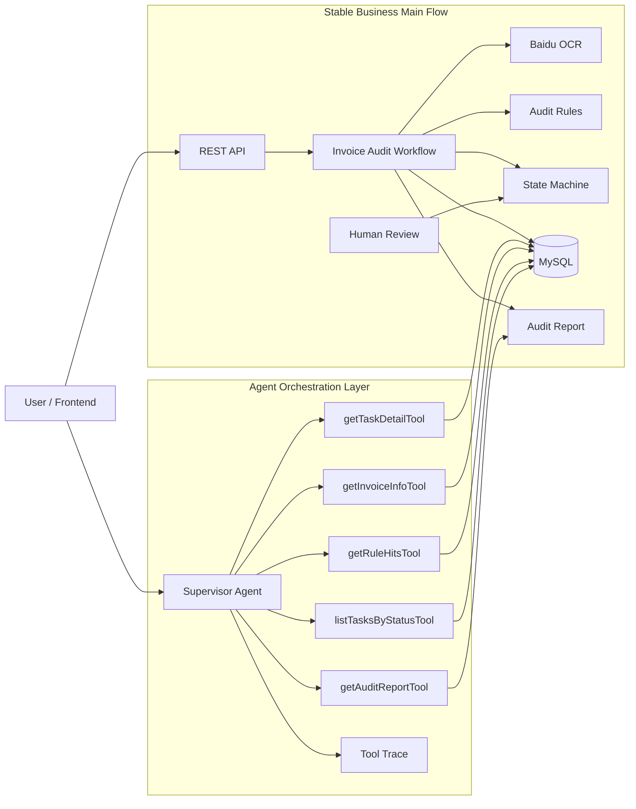
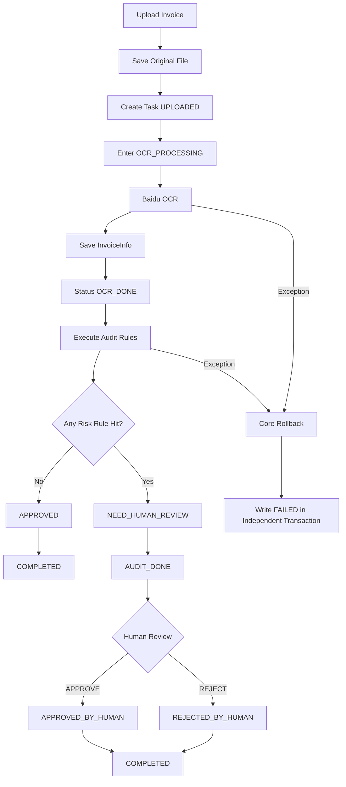
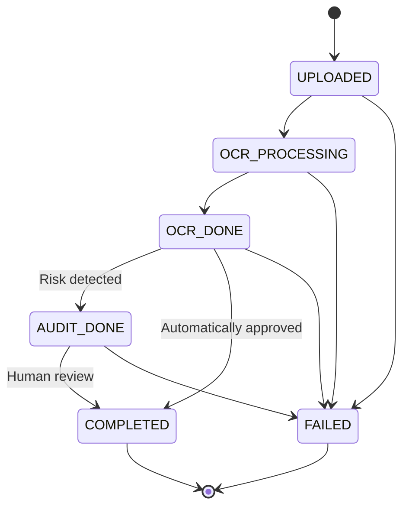
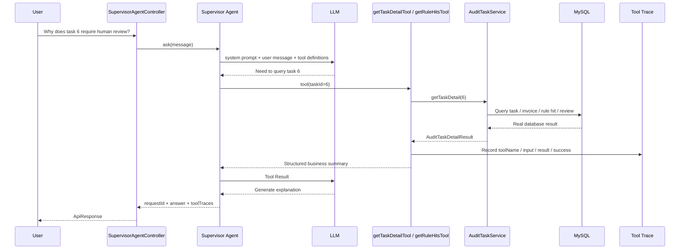
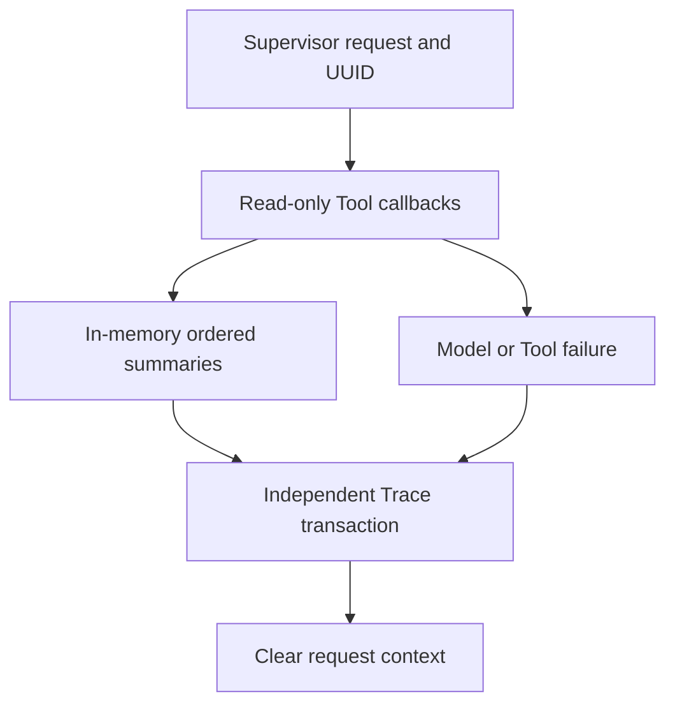
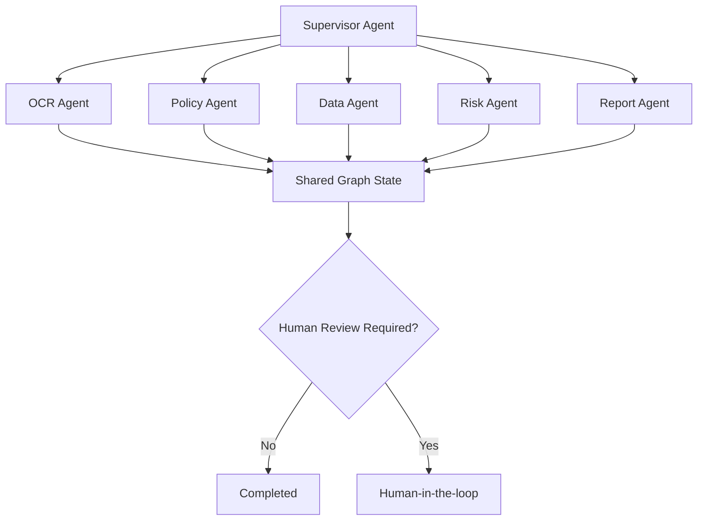

# Intelligent Invoice Reimbursement Audit Multi-Agent System

An intelligent invoice audit backend built with Spring Boot, MyBatis, MySQL, Baidu VAT Invoice OCR, and Spring AI.

The project has completed the traditional business foundation, real OCR, rule-based auditing, task state machine, transaction boundaries, and a Human-in-the-loop closed loop, and has now entered the Agent integration stage. The first Supervisor Agent has been integrated, and existing deterministic business capabilities have been wrapped as read-only Business Tools.

## 1. Current Stage

As of 2026-09-15, the project has evolved from basic invoice CRUD into:

```text
State-driven audit backend
        ↓
Reliable Workflow
        ↓
Supervisor Agent + Business Tools v0.1
        ↓
Future Multi-Agent Graph
```

| Module | Current Status | Description |
|---|---:|---|
| File upload and task creation | Completed | Files are stored by date, and audit tasks are created in the database |
| Real Baidu OCR | Completed and verified | Parses real invoice fields and stores the raw JSON |
| Automatic audit rules | Completed and verified | Required-field, amount-limit, and duplicate-invoice checks |
| Audit report | Completed | Generates UTF-8 TXT reports |
| Task center API | Completed | Pagination, status filtering, details, rules, and report queries |
| Human review | Completed | APPROVE / REJECT, saves review records, and regenerates the report |
| State machine | Completed | OCR_PROCESSING, FAILED, terminal-state protection, and stale-state checks for concurrent updates |
| Transaction boundaries | Completed | create / processing / failed use independent transactions |
| Spring AI integration | Completed v0.1 | Spring AI 1.1.8, compatible with Spring Boot 3.5.x |
| Supervisor Agent | Completed v0.1 | Understands natural-language requests and selects Tools |
| Business Tools | Completed v0.1 | 5 read-only Tools that reuse existing Services |
| Tool Trace | Implemented v0.2 | Server-generated requestId and ordered Tool summaries persisted in an independent transaction |
| Multi-Agent Graph | Not implemented yet | Agents will be split in a later stage |
| Frontend | Not implemented yet | The current focus remains backend Agent capabilities |

## 2. How to Visualize the Whole System Now

You can think of the system as an invoice reimbursement audit center.



Core principle:

```text
LLM is responsible for: understanding, selecting, explaining

Workflow is responsible for: executing the real audit process
State Machine is responsible for: restricting state transitions
Service / Mapper are responsible for: real business logic and database operations

LLM does not directly modify the database
LLM does not bypass the state machine
LLM does not secretly perform human review on behalf of the user
```

## 3. Original Business Main Flow

After a user uploads an invoice:



## 4. State Machine

The state machine has been completed, and valid state transitions are centrally controlled by `AuditTaskStateMachine`.



`COMPLETED` and `FAILED` are terminal states.

Database updates also check the old state:

```sql
UPDATE audit_task
SET status = #{targetStatus},
    updated_at = NOW()
WHERE id = #{id}
  AND status = #{currentStatus};
```

This means:

```text
Request A sees AUDIT_DONE
Request B changes it to COMPLETED first
Request A then tries AUDIT_DONE -> COMPLETED
                    ↓
             SQL updates 0 rows
                    ↓
              Overwrite rejected
```

## 5. What Agent v0.1 Added

New package structure:

```text
invoice_agent_backend/agent/
├── model/
│   ├── SupervisorAgentRequest.java
│   └── SupervisorAgentResponse.java
├── supervisor/
│   ├── SupervisorAgentService.java
│   └── impl/
│       ├── SpringAiSupervisorAgentService.java
│       └── DisabledSupervisorAgentService.java
├── tool/
│   └── InvoiceAuditAgentTools.java
└── trace/
    ├── AgentToolTrace.java
    ├── AgentToolTraceContext.java
    └── AgentToolTraceStore.java
```

Also added:

```text
SupervisorAgentController
POST /api/agent/supervisor
```

## 6. Supervisor Agent Runtime Microscopic Flow

Suppose the user asks:

```text
Why does task 6 require human review?
```

At runtime, the model does not guess the answer itself. Instead:



You can think of this layer as:

```text
LLM = dispatcher
Tool = phone
Service = business department that actually does the work
MySQL = records room
Tool Trace = call log
```

## 7. Current Business Tools

The first version exposes only read-only capabilities, intentionally preventing the LLM from directly executing dangerous write operations.

| Tool | Purpose | Real Data Source |
|---|---|---|
| `getTaskDetailTool` | Query complete task summary | `AuditTaskService.getTaskDetail()` |
| `getInvoiceInfoTool` | Query invoice fields | `AuditTaskService.getInvoiceInfoByTaskId()` |
| `getRuleHitsTool` | Query matched rules | `AuditTaskService.getRuleHitsByTaskId()` |
| `getAuditReportTool` | Read audit report | `AuditTaskService.getReportByTaskId()` |
| `listTasksByStatusTool` | Query recent tasks | `AuditTaskService.getTaskPage()` |

Why the first version does not directly expose:

```text
humanReviewTool
changeStatusTool
rerunOcrTool
```

Once write operations are handed to the model, the risk escalates from “the explanation is wrong” to “the real business state is modified incorrectly.”

So the current strategy is:

```text
Phase D v0.1
Supervisor + Read-only Tools

Phase D v0.2
After permission control, confirmation, idempotency, and auditing
consider controlled Write Tools
```

## 8. Tool Trace

Every valid, enabled Supervisor request receives a server-generated UUID `requestId`. Successful responses return it alongside `answer` and `toolTraces`. Completed Tool calls are persisted when the synchronous request exits, including when a later model or Tool call fails.

For example:

```json
{
  "requestId": "e2dd7693-7c32-48d0-8a97-e95bb2da8942",
  "answer": "Task 6 matched the amount-limit rule, so it requires human review.",
  "toolTraces": [
    {
      "toolName": "getTaskDetailTool",
      "inputSummary": "taskId=6",
      "resultSummary": "taskId=6, status=AUDIT_DONE, finalDecision=NEED_HUMAN_REVIEW",
      "success": true
    }
  ]
}
```



### Database setup and inspection

Apply `backend/invoice-agent-backend/src/main/resources/db/manual/001_agent_tool_trace.sql`
to the existing MySQL application database before enabling the Supervisor. This is an
additive, manual script; it does not change invoice tables and is not run automatically.
The project still does not have Flyway/Liquibase migrations.

`agent_tool_trace` stores `request_id`, `sequence_no` (starting at 1), `tool_name`,
`input_summary`, `result_summary`, `success`, and `called_at`. A unique index on
`(request_id, sequence_no)` preserves each request's call order. Existing summaries
are limited to 500 characters plus the truncation suffix. Full prompts, model answers,
and full Tool results are not added to this table.

```sql
SELECT sequence_no, tool_name, input_summary, result_summary, success, called_at
FROM agent_tool_trace
WHERE request_id = 'e2dd7693-7c32-48d0-8a97-e95bb2da8942'
ORDER BY sequence_no;
```

`AgentToolTraceStore.save` uses `REQUIRES_NEW`: Trace rows commit independently of
invoice business transactions, and a partial failed Trace batch rolls back together.
A persistence failure fails an otherwise successful Supervisor request; if the model
already failed, the original exception is preserved with the persistence failure
suppressed. Failure logs include `requestId`; the existing error response format is
unchanged. The request context is cleared in either case.

This is Tool-call history, not complete request auditing: requests with no Tool calls
have no rows, rejected/unknown tool names do not produce business Tool traces, and a
process crash before final persistence can lose the in-memory calls. ThreadLocal is
still for synchronous calls only. No new history HTTP endpoint is exposed while
authentication and authorization remain unimplemented. Stored summaries may contain
business data or existing error messages; access control, redaction, and retention
remain follow-up work.

### Isolated Agent tests

From `backend/invoice-agent-backend`:

```powershell
.\mvnw.cmd "-Dtest=InvoiceAuditAgentToolsTest,SpringAiSupervisorAgentServiceTest,AgentToolTraceStoreTest" test
```

The scripted Mock ChatModel uses the real ChatClient registration and Spring AI
ToolCallingManager to dispatch JSON arguments through actual Tool callbacks. Tests
cover ordered calls, the five read-only tools, rejection of an unregistered write
Tool, no-call answers, unique request IDs, model/Tool failures, persistence failures,
and request cleanup. H2 in MySQL mode verifies the Mapper SQL, unique request/sequence
constraint, atomic batches, and independent transaction commits. These tests require
no LLM key, OCR service, or external database; H2 does not replace a real MySQL smoke test.
The Agent tests workflow runs this focused suite for backend pull requests.


## 9. Agent Safety Boundary

The first Supervisor version explicitly restricts the system prompt:

1. Do not fabricate tasks, invoices, rules, or audit conclusions.
2. Specific database facts must be obtained by calling a Tool.
3. All current Tools are read-only.
4. Do not claim that a state has been modified.
5. Do not bypass the state machine.
6. Do not perform human APPROVE / REJECT on behalf of the user.
7. The final business state is determined by deterministic data returned by Tools.

Therefore, the current Agent is:

```text
An intelligent orchestration layer above the business system
```

rather than:

```text
A chatbot that can arbitrarily modify the database
```

## 10. Code Layers

| Layer | Main Class | Responsibility |
|---|---|---|
| Controller | `InvoiceController` | Original audit REST API |
| Agent Controller | `SupervisorAgentController` | Agent natural-language entry point |
| Supervisor | `SpringAiSupervisorAgentService` | Understand intent, select Tools, organize answers |
| Agent Tool | `InvoiceAuditAgentTools` | Expose business Services as Tools |
| Tool Trace | `AgentToolTraceContext` / `AgentToolTraceStore` | Collect synchronous call summaries and persist them by requestId |
| Application Service | `AuditTaskServiceImpl` | Query, details, human review, start Workflow |
| Orchestrator | `InvoiceAuditWorkflowServiceImpl` | Files, tasks, Core, exception handling |
| Core Workflow | `InvoiceAuditWorkflowCoreServiceImpl` | Main transaction for OCR, rules, decisions, and report |
| Lifecycle | `AuditTaskLifecycleServiceImpl` | State transitions and independent FAILED transaction |
| State Machine | `AuditTaskStateMachine` | Valid state transitions |
| OCR Adapter | `BaiduOcrServiceImpl` / `MockOcrServiceImpl` | OCR isolation layer |
| Rule Service | `AuditRuleServiceImpl` | Deterministic audit rules |
| Report Service | `AuditReportServiceImpl` | Report generation and reading |
| Persistence | Mapper + XML | MyBatis persistence |

## 11. Current Audit Rules

### 11.1 Required Field Validation

`RULE_REQUIRED_FIELD`

Checks: invoice number, buyer name, seller name.

### 11.2 Amount Limit Validation

`RULE_AMOUNT_LIMIT`

Current threshold:

```text
50000.00 yuan
```

### 11.3 Duplicate Invoice Validation

`RULE_DUPLICATE_INVOICE`

Queries historical records by `invoice_no` and excludes the current task.

## 12. Tech Stack

- Java 17
- Spring Boot 3.5.16
- Spring MVC
- Spring Transaction
- MyBatis 3.0.5
- MySQL
- Maven Wrapper
- Baidu VAT Invoice OCR
- Spring AI 1.1.8
- OpenAI-compatible Chat Model API
- Redis dependency and connection configuration

## 13. API

### Original Business API

| Method | Path | Purpose |
|---|---|---|
| GET | `/health` | Health check |
| POST | `/api/invoices/upload` | Upload invoice and execute the complete audit |
| GET | `/api/invoices/tasks` | Query tasks with pagination |
| GET | `/api/invoices/tasks/{id}` | Query task |
| GET | `/api/invoices/tasks/{id}/invoice-info` | Query OCR result |
| GET | `/api/invoices/tasks/{id}/rule-hits` | Query matched rules |
| GET | `/api/invoices/tasks/{id}/report` | Query audit report |
| GET | `/api/invoices/tasks/{id}/detail` | Query complete task details |
| POST | `/api/invoices/tasks/{id}/human-review` | Human APPROVE / REJECT |

### Agent API

```text
POST /api/agent/supervisor
```

Request example:

```json
{
  "message": "Why does task 6 require human review?"
}
```

You can also ask:

```text
What is the amount of task 6?
Which rules did task 6 match?
What does the audit report for task 6 say?
Which FAILED tasks were created recently?
Which recent tasks require human review?
```

## 14. Local Run

### 14.1 Original Business Backend

The Agent is disabled by default, so the original business Workflow is not affected even without an LLM Key.

```powershell
.\mvnw.cmd clean compile
.\mvnw.cmd test
.\mvnw.cmd spring-boot:run
```

### 14.2 Enable Baidu OCR

```powershell
$env:BAIDU_OCR_API_KEY="Your API Key"
$env:BAIDU_OCR_SECRET_KEY="Your Secret Key"
```

### 14.3 Enable Supervisor Agent

The first version uses an OpenAI-compatible API configuration by default.

DeepSeek example:

```powershell
$env:AGENT_SUPERVISOR_ENABLED="true"
$env:SPRING_AI_MODEL_CHAT="openai"
$env:LLM_API_KEY="Your model API Key"
$env:LLM_BASE_URL="https://api.deepseek.com"
$env:LLM_MODEL="deepseek-chat"
```

Then start:

```powershell
.\mvnw.cmd spring-boot:run
```

If the Agent is not enabled, a request to `/api/agent/supervisor` returns a clear configuration message instead of affecting the entire application startup.

## 15. Current Agent Code Design Focus

### 15.1 Why the Original Workflow Is Not Replaced

The existing Workflow is already responsible for:

```text
Upload
 ↓
OCR
 ↓
Rules
 ↓
State Machine
 ↓
Report
 ↓
Human Review
```

The Agent should reuse it rather than rewrite another version.

The correct evolution path is:

```text
Reliable business capabilities
      ↓
Tool wrapping
      ↓
Supervisor orchestration
      ↓
Multi-Agent Graph
```

### 15.2 Why Read-only Tools Come First

This ensures that even if the first Agent version gives an inaccurate answer, it cannot directly contaminate the real business state.

The risk is limited to:

```text
Answer layer
```

instead of spreading to:

```text
Database state layer
```

## 16. Current Limitations and Technical Debt

1. Tool Trace is persisted at request exit; crash recovery and full request auditing are not implemented.
2. The Agent has a requestId but no conversationId.
3. The Agent currently has no conversational Memory.
4. Controlled write Tools are not exposed yet.
5. Authentication and Tool-level authorization are not implemented yet.
6. Automated business tests still need to be expanded.
7. Database Migration still needs to be completed.
8. Reports are still local TXT files.
9. File-system operations cannot automatically roll back with database transactions.
10. Redis is not yet used for Agent State / Lock / Memory.

## 17. Next Agent Development Roadmap

Do not immediately split OCR Agent, Policy Agent, and Risk Agent at the current stage.

The next step should continue stabilizing the single Supervisor.

### Phase D v0.2: Supervisor Stabilization

```text
Now
Supervisor
  ↓
Read-only Tools
  ↓
Service

Next
Supervisor
  ↓
Tool Registry
  ↓
Trace Persistence
  ↓
Conversation / Request Context
  ↓
Controlled Write Tool
```

Recommended development order:

1. Implemented: `agent_tool_trace` table and independent Trace persistence (apply the manual SQL script).
2. Implemented: generate a server-side `requestId` for each valid enabled Supervisor request.
3. Added: Mock ChatModel tool-calling tests and Mapper/transaction tests. Run the focused suite above before merging.
4. Add unified error wrapping and execution time to Tools.
5. Add a controlled `humanReviewTool`, but require explicit confirmation.
6. Then begin Multi-Agent Graph.

## 18. Future Multi-Agent Graph

After the single Supervisor becomes stable, evolve further:



The future focus is not “adding a few more classes,” but:

- Conditional edges;
- Dynamic routing;
- Retry;
- State recovery;
- Agent Trace;
- Human-in-the-loop;
- Tool permissions;
- Graph State;
- Frontend execution-chain visualization.

## 19. Current Project Positioning

The project is no longer just an invoice CRUD system, but it is not yet a complete Multi-Agent product either.

The accurate positioning is:

> A state-driven intelligent invoice audit backend based on Spring Boot, MyBatis, MySQL, real Baidu OCR, and Spring AI. It has implemented a deterministic audit Workflow, reliable state machine, Human-in-the-loop, and Supervisor Agent + Read-only Business Tools v0.1, with requestId-linked Tool Trace persistence, providing the foundation for future controlled write Tools and Multi-Agent Graph.
