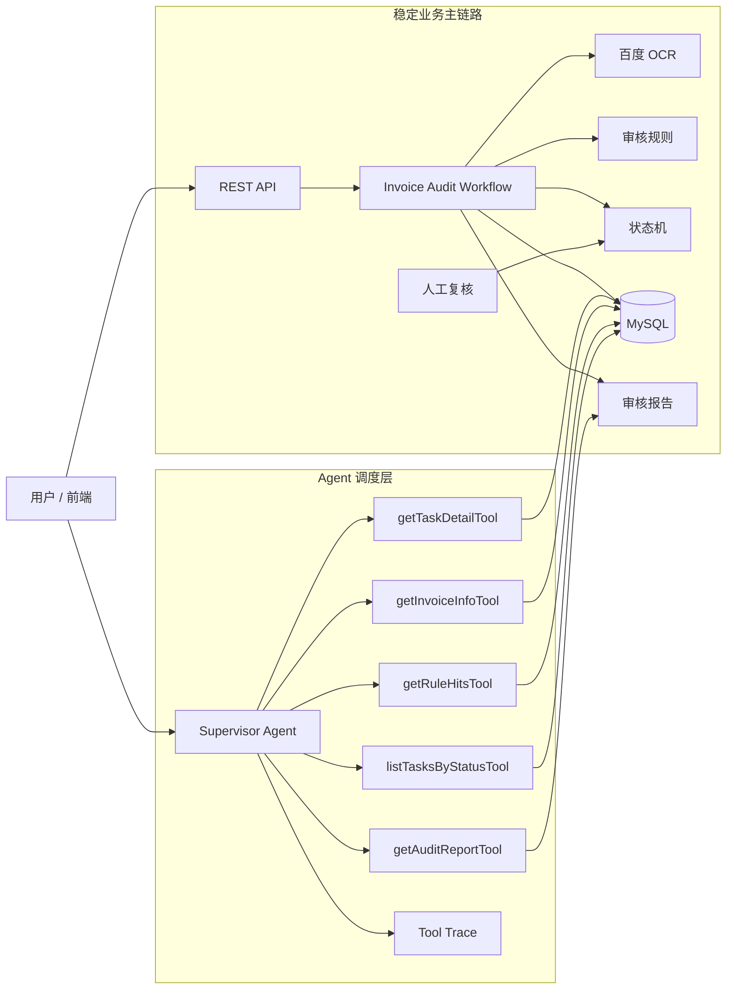
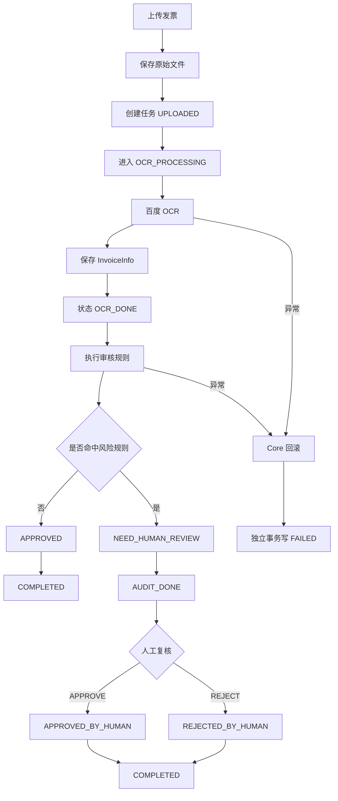
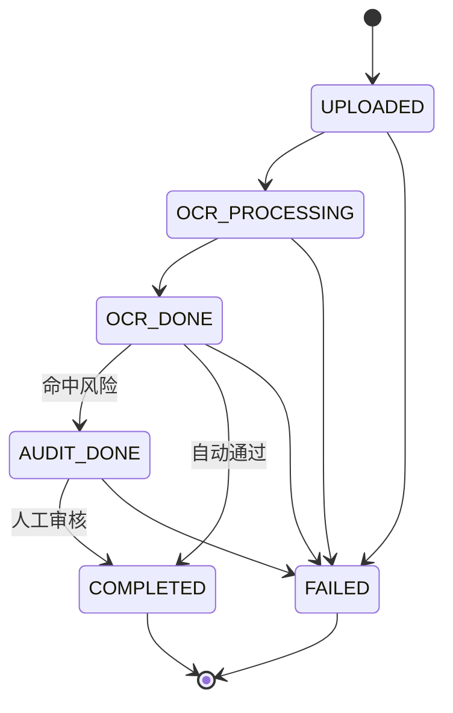
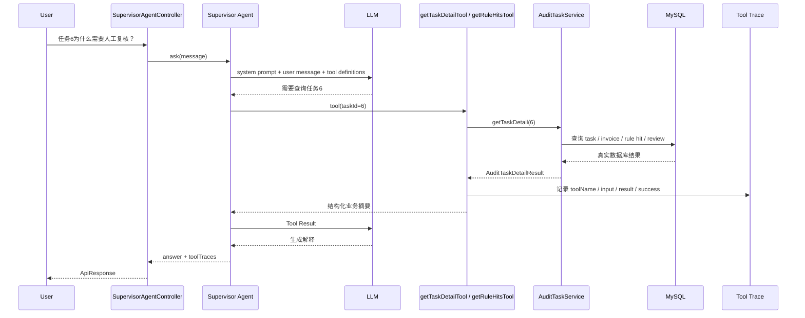
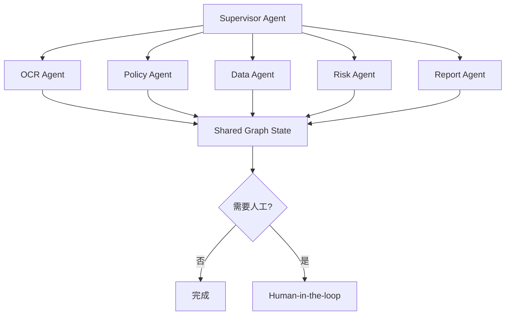

# 智能发票报销审核多 Agent 系统

基于 Spring Boot、MyBatis、MySQL、百度增值税发票 OCR 和 Spring AI 构建的智能发票审核后端。

当前项目已经完成传统业务底座、真实 OCR、规则审核、任务状态机、事务边界、Human-in-the-loop 闭环，并进入 Agent 搭建阶段。第一版 Supervisor Agent 已接入，并将现有确定性业务能力封装为只读 Business Tools。

## 1. 当前阶段

截至 2026-09-15，项目已经从普通发票 CRUD 演进为：

```text
状态驱动审核后端
        ↓
可靠 Workflow
        ↓
Supervisor Agent + Business Tools v0.1
        ↓
未来 Multi-Agent Graph
```

| 模块 | 当前状态 | 说明 |
|---|---:|---|
| 文件上传与任务创建 | 已完成 | 文件按日期保存，数据库创建审核任务 |
| 百度真实 OCR | 已完成并验证 | 解析真实发票字段并保存原始 JSON |
| 自动审核规则 | 已完成并验证 | 必要字段、金额超限、重复发票检测 |
| 审核报告 | 已完成 | 生成 UTF-8 TXT 报告 |
| 任务中心 API | 已完成 | 分页、状态筛选、详情、规则、报告查询 |
| 人工复核 | 已完成 | APPROVE / REJECT，保存记录并重新生成报告 |
| 状态机 | 已完成 | OCR_PROCESSING、FAILED、终态保护、并发旧状态校验 |
| 事务边界 | 已完成 | create / processing / failed 使用独立事务 |
| Spring AI 接入 | 已完成 v0.1 | Spring AI 1.1.8，兼容 Spring Boot 3.5.x |
| Supervisor Agent | 已完成 v0.1 | 理解自然语言请求并选择 Tool |
| Business Tools | 已完成 v0.1 | 5 个只读 Tool，复用现有 Service |
| Tool Trace | 已完成 v0.1 | 每次 Agent 请求返回 Tool 调用轨迹 |
| Multi-Agent Graph | 尚未实现 | 下一阶段再拆 Agent |
| 前端 | 尚未实现 | 当前重点仍是后端 Agent 能力 |

## 2. 现在整个系统可以怎么想象

可以把系统想成一家报销审核中心。



核心原则：

```text
LLM 负责：理解、选择、解释

Workflow 负责：执行真实审核流程
State Machine 负责：限制状态变化
Service / Mapper 负责：真实业务和数据库

LLM 不直接改数据库
LLM 不绕过状态机
LLM 不替用户偷偷执行人工审核
```

## 3. 原有业务主流程

用户上传一张发票后：



## 4. 状态机

状态机已经完成，合法状态迁移集中由 `AuditTaskStateMachine` 控制。



`COMPLETED` 和 `FAILED` 是终态。

数据库更新同时检查旧状态：

```sql
UPDATE audit_task
SET status = #{targetStatus},
    updated_at = NOW()
WHERE id = #{id}
  AND status = #{currentStatus};
```

这意味着：

```text
请求 A 看到 AUDIT_DONE
请求 B 先把它改成 COMPLETED
请求 A 再尝试用 AUDIT_DONE -> COMPLETED
                    ↓
             SQL 更新 0 行
                    ↓
                拒绝覆盖
```

## 5. Agent v0.1 新增了什么

新增包结构：

```text
invoice_agent_backend/agent/
├── model/
│   ├── SupervisorAgentRequest.java
│   └── SupervisorAgentResponse.java
├── supervisor/
│   ├── SupervisorAgentService.java
│   └── impl/
│       ├── SpringAiSupervisorAgentService.java
│       └── DisabledSupervisorAgentService.java
├── tool/
│   └── InvoiceAuditAgentTools.java
└── trace/
    ├── AgentToolTrace.java
    └── AgentToolTraceContext.java
```

另外新增：

```text
SupervisorAgentController
POST /api/agent/supervisor
```

## 6. Supervisor Agent 运行时微观链路

假设用户问：

```text
任务 6 为什么需要人工复核？
```

运行时不是模型自己猜答案，而是：



可以把这一层想成：

```text
LLM = 调度员
Tool = 电话
Service = 真正办事的业务部门
MySQL = 档案室
Tool Trace = 通话记录
```

## 7. 当前 Business Tools

第一版只开放只读能力，故意不让 LLM 直接执行危险写操作。

| Tool | 作用 | 真实数据来源 |
|---|---|---|
| `getTaskDetailTool` | 查询完整任务摘要 | `AuditTaskService.getTaskDetail()` |
| `getInvoiceInfoTool` | 查询发票字段 | `AuditTaskService.getInvoiceInfoByTaskId()` |
| `getRuleHitsTool` | 查询命中规则 | `AuditTaskService.getRuleHitsByTaskId()` |
| `getAuditReportTool` | 读取审核报告 | `AuditTaskService.getReportByTaskId()` |
| `listTasksByStatusTool` | 查询最近任务 | `AuditTaskService.getTaskPage()` |

为什么第一版不直接开放：

```text
humanReviewTool
changeStatusTool
rerunOcrTool
```

因为写操作一旦交给模型，风险会从“解释错了”升级成“真实业务状态被改错”。

所以当前策略是：

```text
Phase D v0.1
Supervisor + Read-only Tools

Phase D v0.2
经过权限、确认、幂等和审计后
再考虑受控 Write Tools
```

## 8. Tool Trace

每一次 Supervisor 请求都会返回调用轨迹。

例如：

```json
{
  "answer": "任务 6 命中了金额超限规则，因此需要人工复核。",
  "toolTraces": [
    {
      "toolName": "getTaskDetailTool",
      "inputSummary": "taskId=6",
      "resultSummary": "taskId=6, status=AUDIT_DONE, finalDecision=NEED_HUMAN_REVIEW",
      "success": true
    }
  ]
}
```

现在 Tool Trace 先存在单次 HTTP 请求内，后续可以继续升级：

```text
内存 trace
   ↓
requestId
   ↓
trace table
   ↓
完整 Agent execution history
   ↓
前端可视化执行链路
```

## 9. Agent 安全边界

第一版 Supervisor 的系统提示词明确限制：

1. 不编造任务、发票、规则和审核结论。
2. 涉及具体数据库事实时必须调用 Tool。
3. Tool 当前都是只读能力。
4. 不允许声称已经修改状态。
5. 不允许绕过状态机。
6. 不允许替用户执行人工 APPROVE / REJECT。
7. 最终业务状态以 Tool 返回的确定性数据为准。

因此现在 Agent 是：

```text
业务系统上方的智能调度层
```

而不是：

```text
可以随意改数据库的聊天机器人
```

## 10. 代码分层

| 层级 | 主要类 | 职责 |
|---|---|---|
| Controller | `InvoiceController` | 原审核 REST API |
| Agent Controller | `SupervisorAgentController` | Agent 自然语言入口 |
| Supervisor | `SpringAiSupervisorAgentService` | 理解意图、选择 Tool、组织答案 |
| Agent Tool | `InvoiceAuditAgentTools` | 把业务 Service 暴露成 Tool |
| Tool Trace | `AgentToolTraceContext` | 保存单次 Agent Tool 调用轨迹 |
| Application Service | `AuditTaskServiceImpl` | 查询、详情、人工复核、启动 Workflow |
| Orchestrator | `InvoiceAuditWorkflowServiceImpl` | 文件、任务、Core、异常处理 |
| Core Workflow | `InvoiceAuditWorkflowCoreServiceImpl` | OCR、规则、决策、报告主事务 |
| Lifecycle | `AuditTaskLifecycleServiceImpl` | 状态迁移和 FAILED 独立事务 |
| State Machine | `AuditTaskStateMachine` | 合法状态转换 |
| OCR Adapter | `BaiduOcrServiceImpl` / `MockOcrServiceImpl` | OCR 隔离层 |
| Rule Service | `AuditRuleServiceImpl` | 确定性审核规则 |
| Report Service | `AuditReportServiceImpl` | 报告生成与读取 |
| Persistence | Mapper + XML | MyBatis 持久化 |

## 11. 当前审核规则

### 11.1 必要字段校验

`RULE_REQUIRED_FIELD`

检查：发票号码、购买方名称、销售方名称。

### 11.2 金额超限校验

`RULE_AMOUNT_LIMIT`

当前阈值：

```text
50000.00 元
```

### 11.3 重复发票校验

`RULE_DUPLICATE_INVOICE`

根据 `invoice_no` 查询历史记录，并排除当前 task。

## 12. 技术栈

- Java 17
- Spring Boot 3.5.16
- Spring MVC
- Spring Transaction
- MyBatis 3.0.5
- MySQL
- Maven Wrapper
- 百度增值税发票 OCR
- Spring AI 1.1.8
- OpenAI-compatible Chat Model API
- Redis 依赖与连接配置

## 13. API

### 原业务 API

| Method | Path | 作用 |
|---|---|---|
| GET | `/health` | 健康检查 |
| POST | `/api/invoices/upload` | 上传发票并执行完整审核 |
| GET | `/api/invoices/tasks` | 分页查询任务 |
| GET | `/api/invoices/tasks/{id}` | 查询任务 |
| GET | `/api/invoices/tasks/{id}/invoice-info` | 查询 OCR 结果 |
| GET | `/api/invoices/tasks/{id}/rule-hits` | 查询规则命中 |
| GET | `/api/invoices/tasks/{id}/report` | 查询审核报告 |
| GET | `/api/invoices/tasks/{id}/detail` | 查询完整任务详情 |
| POST | `/api/invoices/tasks/{id}/human-review` | 人工 APPROVE / REJECT |

### Agent API

```text
POST /api/agent/supervisor
```

请求示例：

```json
{
  "message": "任务 6 为什么需要人工复核？"
}
```

还可以问：

```text
任务 6 的金额是多少？
任务 6 命中了哪些规则？
任务 6 的审核报告说了什么？
最近有哪些 FAILED 任务？
最近有哪些需要人工复核的任务？
```

## 14. 本地运行

### 14.1 原业务后端

Agent 默认关闭，所以没有 LLM Key 也不会影响原业务 Workflow。

```powershell
.\mvnw.cmd clean compile
.\mvnw.cmd test
.\mvnw.cmd spring-boot:run
```

### 14.2 开启百度 OCR

```powershell
$env:BAIDU_OCR_API_KEY="你的 API Key"
$env:BAIDU_OCR_SECRET_KEY="你的 Secret Key"
```

### 14.3 开启 Supervisor Agent

第一版默认按 OpenAI-compatible API 配置。

DeepSeek 示例：

```powershell
$env:AGENT_SUPERVISOR_ENABLED="true"
$env:SPRING_AI_MODEL_CHAT="openai"
$env:LLM_API_KEY="你的模型 API Key"
$env:LLM_BASE_URL="https://api.deepseek.com"
$env:LLM_MODEL="deepseek-chat"
```

然后启动：

```powershell
.\mvnw.cmd spring-boot:run
```

如果 Agent 没有开启，请求 `/api/agent/supervisor` 会返回清晰配置提示，而不是影响整个应用启动。

## 15. 当前 Agent 代码的设计重点

### 15.1 为什么不推翻原 Workflow

现有 Workflow 已经负责：

```text
上传
 ↓
OCR
 ↓
规则
 ↓
状态机
 ↓
报告
 ↓
人工复核
```

Agent 应该复用它，而不是重新写一套。

正确演进路线：

```text
可靠业务能力
      ↓
Tool 化
      ↓
Supervisor 调度
      ↓
Multi-Agent Graph
```

### 15.2 为什么先只读 Tool

这让第一版 Agent 即使回答有偏差，也不会直接污染真实业务状态。

风险被限制在：

```text
答案层
```

而不是扩散到：

```text
数据库状态层
```

## 16. 当前限制与技术债务

1. Agent Tool Trace 暂时没有落库。
2. Agent 目前没有 requestId / conversationId。
3. Agent 当前没有会话 Memory。
4. 暂未开放受控写 Tool。
5. 暂未实现权限认证和 Tool 级授权。
6. 自动化业务测试仍需继续补充。
7. 数据库 Migration 仍需补齐。
8. 报告还是本地 TXT 文件。
9. 文件系统操作不能跟随数据库事务自动回滚。
10. Redis 暂未用于 Agent State / Lock / Memory。

## 17. 下一步 Agent 开发路线

当前不要马上拆 OCR Agent、Policy Agent、Risk Agent。

下一步应该继续把单 Supervisor 做稳。

### Phase D v0.2：Supervisor 稳定化

```text
现在
Supervisor
  ↓
Read-only Tools
  ↓
Service

下一步
Supervisor
  ↓
Tool Registry
  ↓
Trace Persistence
  ↓
Conversation / Request Context
  ↓
受控 Write Tool
```

建议开发顺序：

1. 增加 `agent_tool_trace` 表，把 Tool Trace 落库。
2. 为每次 Agent 请求生成 `requestId`。
3. 增加 Supervisor 自动化测试，Mock ChatModel 验证 Tool Calling。
4. 给 Tool 增加统一错误包装和执行时间。
5. 增加受控 `humanReviewTool`，但必须要求显式确认。
6. 再开始 Multi-Agent Graph。

## 18. 未来 Multi-Agent Graph

单 Supervisor 稳定后再演进：



未来重点不是“多几个类”，而是：

- 条件边；
- 动态路由；
- 重试；
- 状态恢复；
- Agent Trace；
- Human-in-the-loop；
- Tool 权限；
- Graph State；
- 前端链路可视化。

## 19. 当前项目定位

当前项目已经不只是一个发票 CRUD，也还不是完整 Multi-Agent 产品。

准确定位是：

> 一个基于 Spring Boot、MyBatis、MySQL、百度真实 OCR 和 Spring AI 的状态驱动智能发票审核后端，已经实现确定性审核 Workflow、可靠状态机、Human-in-the-loop，并完成 Supervisor Agent + Read-only Business Tools v0.1，为后续 Tool Trace 持久化、受控写 Tool 和 Multi-Agent Graph 提供基础。
