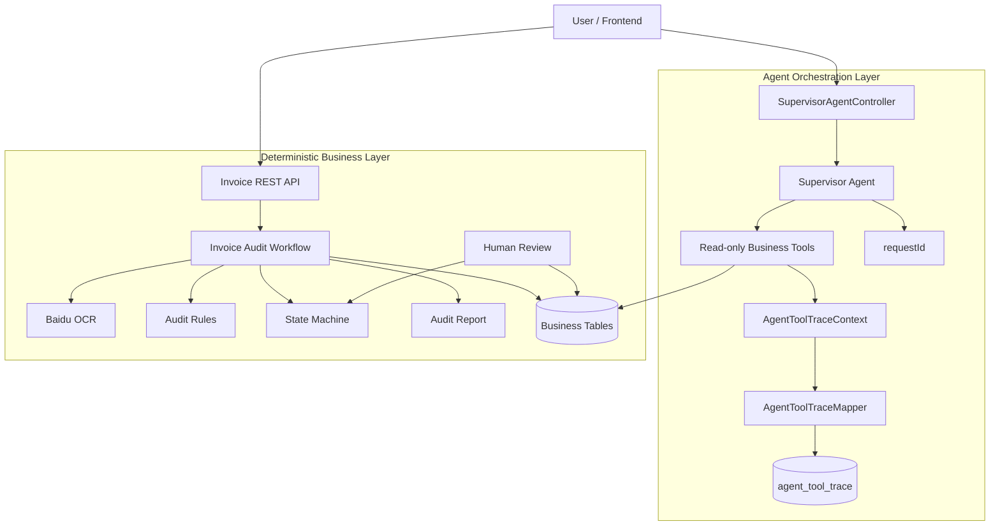
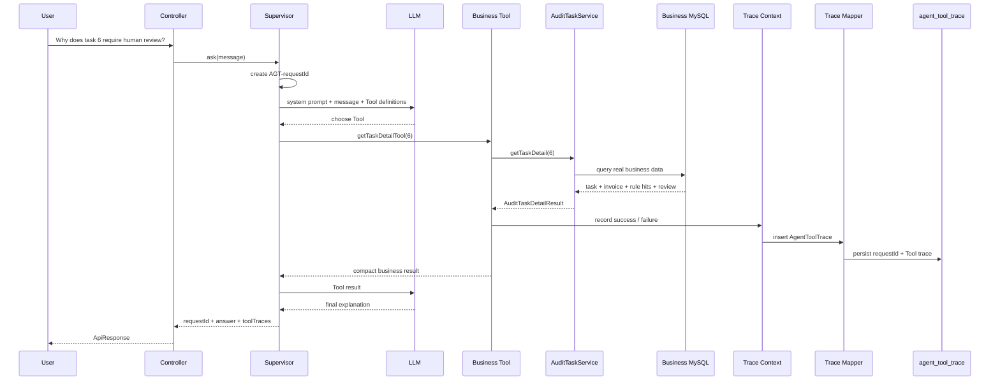
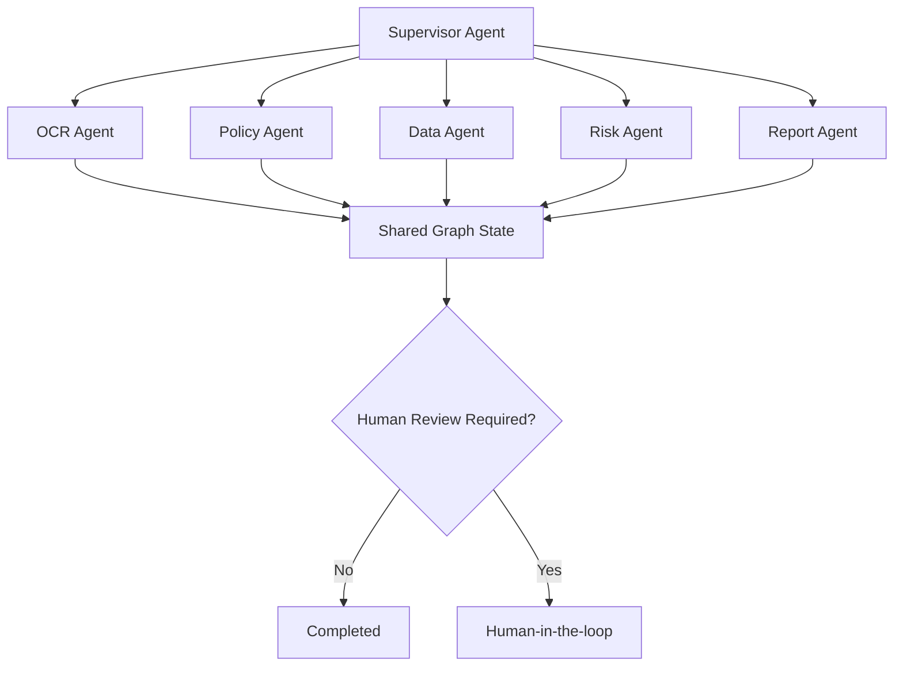

# Intelligent Invoice Reimbursement Audit Multi-Agent System

An intelligent invoice audit backend built with Spring Boot, MyBatis, MySQL, Baidu VAT Invoice OCR, and Spring AI.

The project has completed the deterministic invoice-audit business foundation and has entered the Agent integration stage. The current version keeps OCR, rules, state transitions, transactions, reports, and Human-in-the-loop inside the reliable Java Workflow, while the Supervisor Agent is responsible for natural-language understanding, Tool selection, and explanation.

## 1. Current Stage

As of 2026-09-25, the project has evolved through the following stages:

```text
Basic invoice CRUD
        ↓
Real OCR + audit rules
        ↓
State-driven deterministic Workflow
        ↓
Supervisor Agent + read-only Business Tools v0.1
        ↓
requestId + persistent Tool Trace v0.2
        ↓
Next: Supervisor Tool-Calling verification
        ↓
Future: controlled write Tools
        ↓
Future: Multi-Agent Graph
```

| Module | Current Status | Description |
|---|---:|---|
| File upload and task creation | Completed | Files are stored by date and audit tasks are created in MySQL |
| Real Baidu OCR | Completed and verified | Parses invoice fields and stores raw OCR JSON |
| Automatic audit rules | Completed and verified | Required-field, amount-limit, and duplicate-invoice checks |
| Audit report | Completed | Generates UTF-8 TXT reports |
| Task center API | Completed | Pagination, filtering, details, OCR fields, rules, and report queries |
| Human review | Completed | APPROVE / REJECT, review record persistence, final report regeneration |
| State machine | Completed | Valid transitions, terminal-state protection, stale-state checks |
| Transaction boundaries | Completed | Task creation, processing state, Core transaction, FAILED recovery |
| Spring AI integration | Completed v0.1 | Spring AI 1.1.8 on Spring Boot 3.5.x |
| Supervisor Agent | Completed v0.1 | Understands requests and can select Business Tools |
| Business Tools | Completed v0.1 | Five read-only Tools reuse existing Services |
| requestId | Completed v0.2 | Every enabled Supervisor request gets a unique `AGT-*` request ID |
| Tool Trace | Completed v0.2 | Tool calls are returned in the response and persisted to MySQL |
| Tool Calling automated verification | Next | Verify that different prompts trigger the expected Tools |
| Controlled write Tools | Not implemented | Will require confirmation, idempotency, authorization, and audit boundaries |
| Multi-Agent Graph | Not implemented | Will be introduced after the single Supervisor becomes reliable |
| Frontend | Not implemented | Backend Agent capabilities remain the current focus |

## 2. How to Visualize the Whole System

The system now has two layers.

The lower layer is the reliable business engine. The upper layer is the intelligent orchestration layer.



Core principle:

```text
LLM / Supervisor
= understand + choose + explain

Business Tool
= controlled entrance to existing backend capability

Workflow
= execute the real audit process

State Machine
= decide which state transitions are legal

Service / Mapper / MySQL
= source of business truth

Tool Trace
= record what the Agent actually called
```

The LLM does not directly update business tables, does not bypass the state machine, and does not perform APPROVE / REJECT on behalf of a reviewer.

## 3. Deterministic Business Main Flow

After a user uploads an invoice:


This path remains deterministic even after the Agent layer is enabled.

## 4. State Machine

Valid transitions are centrally controlled by `AuditTaskStateMachine`.


`COMPLETED` and `FAILED` are terminal states.

State updates also verify the previous state:

```sql
UPDATE audit_task
SET status = #{targetStatus},
    updated_at = NOW()
WHERE id = #{id}
  AND status = #{currentStatus};
```

This prevents stale concurrent requests from silently overwriting a newer state.

## 5. Agent Package Structure

```text
invoice_agent_backend/
├── agent/
│   ├── model/
│   │   ├── SupervisorAgentRequest.java
│   │   └── SupervisorAgentResponse.java
│   ├── supervisor/
│   │   ├── SupervisorAgentService.java
│   │   └── impl/
│   │       ├── SpringAiSupervisorAgentService.java
│   │       └── DisabledSupervisorAgentService.java
│   ├── tool/
│   │   └── InvoiceAuditAgentTools.java
│   └── trace/
│       ├── AgentToolTrace.java
│       └── AgentToolTraceContext.java
│
├── mapper/
│   └── AgentToolTraceMapper.java
│
└── controller/
    └── SupervisorAgentController.java
```

MyBatis XML:

```text
src/main/resources/mapper/AgentToolTraceMapper.xml
```

Agent HTTP entry:

```text
POST /api/agent/supervisor
```

## 6. Supervisor Runtime: Microscopic Flow

Suppose the user asks:

```text
Why does task 6 require human review?
```

The runtime chain is now:



A useful mental model is:

```text
Supervisor = dispatcher
Business Tool = phone extension
Service = business department
MySQL = source-of-truth archive
requestId = case number
Tool Trace = call record
```

## 7. Current Business Tools

The first Agent version intentionally exposes only read-only capabilities.

| Tool | Purpose | Real Data Source |
|---|---|---|
| `getTaskDetailTool` | Query full task summary | `AuditTaskService.getTaskDetail()` |
| `getInvoiceInfoTool` | Query invoice fields | `AuditTaskService.getInvoiceInfoByTaskId()` |
| `getRuleHitsTool` | Query matched audit rules | `AuditTaskService.getRuleHitsByTaskId()` |
| `getAuditReportTool` | Read generated report | `AuditTaskService.getReportByTaskId()` |
| `listTasksByStatusTool` | Query recent tasks | `AuditTaskService.getTaskPage()` |

The following capabilities are intentionally not exposed yet:

```text
humanReviewTool
changeStatusTool
rerunOcrTool
directSqlTool
```

Reason:

```text
Wrong explanation
= answer-layer risk

Wrong write operation
= real business-state corruption
```

Write Tools will only be introduced after confirmation, authorization, idempotency, and audit controls exist.

## 8. requestId and Persistent Tool Trace

Every enabled Supervisor request now creates a unique ID:

```text
AGT-xxxxxxxx-xxxx-xxxx-xxxx-xxxxxxxxxxxx
```

If one user request causes multiple Tool calls, they share the same `requestId`.

Example response shape:

```json
{
  "requestId": "AGT-12345678-1234-1234-1234-123456789abc",
  "answer": "Task 6 matched an audit rule and requires human review.",
  "toolTraces": [
    {
      "requestId": "AGT-12345678-1234-1234-1234-123456789abc",
      "toolName": "getTaskDetailTool",
      "inputSummary": "taskId=6",
      "resultSummary": "taskId=6, status=AUDIT_DONE, finalDecision=NEED_HUMAN_REVIEW",
      "success": true
    }
  ]
}
```

The database path is:

```text
Supervisor request
      ↓
requestId
      ↓
Tool 1 ─┐
Tool 2 ─┼─> AgentToolTraceContext
Tool 3 ─┘          ↓
             AgentToolTraceMapper
                    ↓
             agent_tool_trace
```

Trace persistence is deliberately best-effort: if the trace table is temporarily unavailable, the real business query should not be destroyed by an observability failure. The current in-memory trace can still be returned for that request while the persistence error is logged.

## 9. Agent Safety Boundary

The current Supervisor must obey these boundaries:

1. Do not fabricate tasks, invoices, rule hits, or audit conclusions.
2. Concrete database facts must come from Business Tools.
3. Current Tools are read-only.
4. Do not claim that a state has been changed when no write operation occurred.
5. Do not bypass `AuditTaskStateMachine`.
6. Do not perform human APPROVE / REJECT for the user.
7. Business truth comes from Tool results, not model confidence.
8. Trace persistence must not mutate invoice business state.

Therefore the Agent is currently:

```text
an intelligent orchestration and explanation layer
above a deterministic business system
```

not:

```text
a chatbot with unrestricted database authority
```

## 10. Code Layers

| Layer | Main Class | Responsibility |
|---|---|---|
| Business Controller | `InvoiceController` | Original invoice audit REST API |
| Agent Controller | `SupervisorAgentController` | Natural-language Agent entry |
| Supervisor | `SpringAiSupervisorAgentService` | Intent understanding, Tool selection, answer generation |
| Business Tools | `InvoiceAuditAgentTools` | Expose existing Services to the model |
| Trace Context | `AgentToolTraceContext` | Isolate one synchronous request and record Tool calls |
| Trace Persistence | `AgentToolTraceMapper` | Persist Tool calls by requestId |
| Application Service | `AuditTaskServiceImpl` | Query, details, human review, Workflow entry |
| Orchestrator | `InvoiceAuditWorkflowServiceImpl` | File handling, task creation, Core invocation, recovery |
| Core Workflow | `InvoiceAuditWorkflowCoreServiceImpl` | OCR, rules, automatic decision, report transaction |
| Lifecycle | `AuditTaskLifecycleServiceImpl` | State transitions and FAILED recovery |
| State Machine | `AuditTaskStateMachine` | Legal transition rules |
| OCR Adapter | `BaiduOcrServiceImpl` / `MockOcrServiceImpl` | OCR provider isolation |
| Rule Service | `AuditRuleServiceImpl` | Deterministic audit rules |
| Report Service | `AuditReportServiceImpl` | Generate and read reports |
| Persistence | Mapper + XML | MyBatis persistence |

## 11. Current Audit Rules

### 11.1 Required Field Validation

`RULE_REQUIRED_FIELD`

Checks invoice number, buyer name, and seller name.

### 11.2 Amount Limit Validation

`RULE_AMOUNT_LIMIT`

Current threshold:

```text
50000.00 yuan
```

### 11.3 Duplicate Invoice Validation

`RULE_DUPLICATE_INVOICE`

Queries historical `invoice_info` by invoice number while excluding the current task.

## 12. Database Tables

Current main business tables:

```text
audit_task
invoice_info
audit_rule_hit
human_review_record
audit_task_log
```

Agent observability table:

```text
agent_tool_trace
```

Key fields:

```text
id
request_id
tool_name
input_summary
result_summary
success
called_at
```

`sql/init.sql` now includes both `human_review_record` and `agent_tool_trace` so a fresh database is closer to the real code requirements.

The project still does not use Flyway or Liquibase, so schema migration remains technical debt.

## 13. Tech Stack

- Java 17
- Spring Boot 3.5.16
- Spring MVC
- Spring Transaction
- MyBatis 3.0.5
- MySQL
- Maven Wrapper
- Baidu VAT Invoice OCR
- Spring AI 1.1.8
- OpenAI-compatible Chat Model API
- DeepSeek API configuration
- Redis dependency and connection configuration

## 14. API

### Business API

| Method | Path | Purpose |
|---|---|---|
| GET | `/health` | Health check |
| POST | `/api/invoices/upload` | Upload invoice and execute full audit Workflow |
| GET | `/api/invoices/tasks` | Query tasks with pagination |
| GET | `/api/invoices/tasks/{id}` | Query one task |
| GET | `/api/invoices/tasks/{id}/invoice-info` | Query OCR result |
| GET | `/api/invoices/tasks/{id}/rule-hits` | Query matched rules |
| GET | `/api/invoices/tasks/{id}/report` | Query report |
| GET | `/api/invoices/tasks/{id}/detail` | Query aggregated task details |
| POST | `/api/invoices/tasks/{id}/human-review` | Human APPROVE / REJECT |

### Agent API

```text
POST /api/agent/supervisor
```

Request:

```json
{
  "message": "Why does task 6 require human review?"
}
```

Typical questions:

```text
What is the amount of task 6?
Which rules did task 6 match?
What does the audit report for task 6 say?
Which FAILED tasks were created recently?
Which recent tasks require human review?
```

## 15. Local Run

### 15.1 Initialize / update the database

Run:

```text
sql/init.sql
```

All table statements use `CREATE TABLE IF NOT EXISTS`, so the script can add newly introduced tables without deleting existing business data.

### 15.2 Original Business Backend

The Agent is disabled by default, so the original deterministic Workflow does not require an LLM API key.

```powershell
.\mvnw.cmd clean compile
.\mvnw.cmd test
.\mvnw.cmd spring-boot:run
```

### 15.3 Enable Baidu OCR

```powershell
$env:BAIDU_OCR_API_KEY="Your API Key"
$env:BAIDU_OCR_SECRET_KEY="Your Secret Key"
```

### 15.4 Enable Supervisor Agent

The Agent uses environment variables. Never commit real credentials to Git.

DeepSeek example:

```powershell
$env:AGENT_SUPERVISOR_ENABLED="true"
$env:SPRING_AI_MODEL_CHAT="openai"
$env:LLM_API_KEY="Your model API Key"
$env:LLM_BASE_URL="https://api.deepseek.com"
$env:LLM_MODEL="deepseek-flash"
```

Then start:

```powershell
.\mvnw.cmd spring-boot:run
```

When the Agent is disabled, the existing business backend remains available.

## 16. Why the Existing Workflow Is Not Replaced

The deterministic Workflow already owns:

```text
Upload
 ↓
OCR
 ↓
Rules
 ↓
State Machine
 ↓
Report
 ↓
Human Review
```

The Agent should reuse those capabilities instead of creating a second audit engine.

Correct evolution path:

```text
Reliable backend capabilities
      ↓
Business Tool wrapping
      ↓
Single Supervisor
      ↓
requestId + Trace
      ↓
Tool-Calling verification
      ↓
Controlled write capabilities
      ↓
Multi-Agent Graph
```

## 17. Current Limitations and Technical Debt

1. Supervisor Tool selection still needs dedicated automated integration tests with a controlled ChatModel.
2. `requestId` exists, but `conversationId` and conversational Memory do not exist yet.
3. There is not yet an HTTP query API for historical traces by requestId.
4. Controlled write Tools are not exposed yet.
5. Authentication and Tool-level authorization are not implemented yet.
6. Automated business regression coverage still needs expansion.
7. Database Migration with Flyway or Liquibase is not implemented.
8. Audit reports are local TXT files.
9. File-system writes cannot automatically roll back with database transactions.
10. Redis is not yet used for Agent State, locks, or Memory.
11. The current Trace Context assumes blocking / synchronous Tool Calling; asynchronous or streaming Agent execution will require explicit context propagation.

## 18. Next Agent Development Roadmap

The current stage should continue stabilizing the single Supervisor instead of immediately creating OCR Agent, Policy Agent, Risk Agent, and Report Agent.

### Completed in v0.2

```text
Supervisor request
      ↓
requestId
      ↓
Read-only Tool Calling
      ↓
In-request Trace
      ↓
Persistent agent_tool_trace
```

### Immediate next step

Verify Supervisor Tool selection automatically.

Example expectations:

```text
"What is the amount of task 6?"
        ↓
getInvoiceInfoTool(6)

"Why does task 6 require human review?"
        ↓
getTaskDetailTool(6)
and/or getRuleHitsTool(6)

"Show recent FAILED tasks"
        ↓
listTasksByStatusTool("FAILED")
```

After Tool-Calling verification:

```text
Supervisor
   ↓
Error / timing metadata
   ↓
Historical Trace query API
   ↓
Permission + confirmation boundary
   ↓
Controlled business write Tool
   ↓
Multi-Agent Graph
```

Recommended order:

1. Add Supervisor automated Tool-Calling tests with a controlled / mock ChatModel.
2. Add execution duration and unified Tool error metadata.
3. Expose historical Agent Trace lookup by `requestId`.
4. Define Tool-level permission and confirmation rules.
5. Add one controlled business write Tool through the existing Workflow / Service boundary.
6. Only then start splitting responsibilities into a Multi-Agent Graph.

## 19. Future Multi-Agent Graph

After the single Supervisor is stable:



The future focus is not simply adding more classes. It is adding reliable orchestration capabilities:

- Conditional routing;
- Retry;
- State recovery;
- Agent Trace;
- Human-in-the-loop;
- Tool permissions;
- Shared Graph State;
- Frontend execution-chain visualization.

## 20. Current Project Positioning

The project is no longer a basic invoice CRUD application, but it is not yet a complete Multi-Agent product.

The accurate positioning is:

> A state-driven intelligent invoice audit backend based on Spring Boot, MyBatis, MySQL, real Baidu OCR, and Spring AI. It combines a deterministic audit Workflow and Human-in-the-loop with a Supervisor Agent, read-only Business Tools, request-level IDs, and persistent Tool Trace, providing a reliable foundation for controlled Agent actions and future Multi-Agent orchestration.
