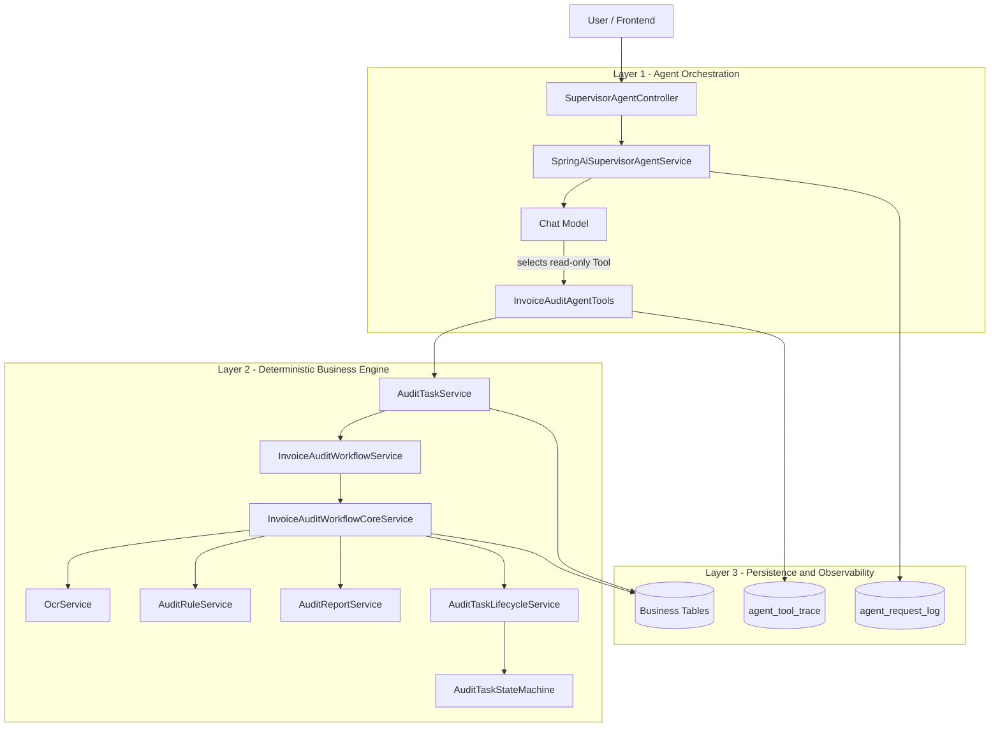
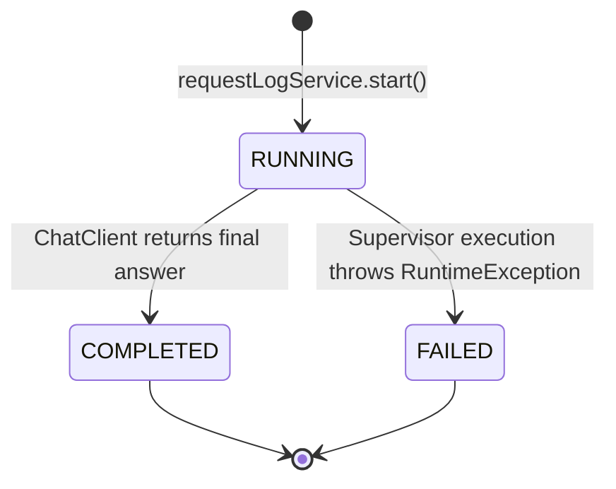
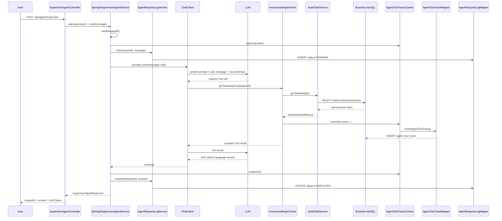
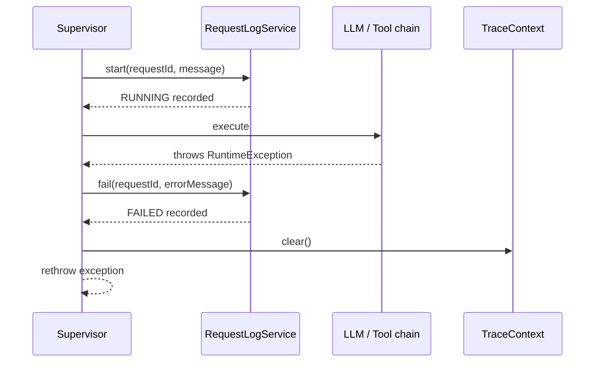
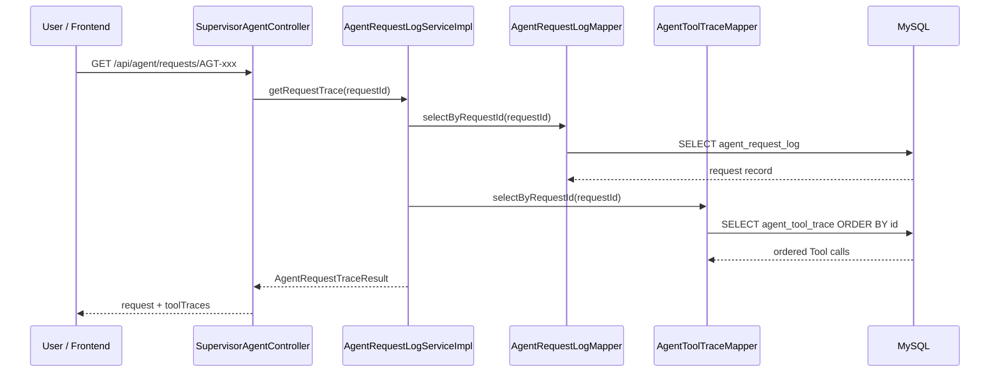
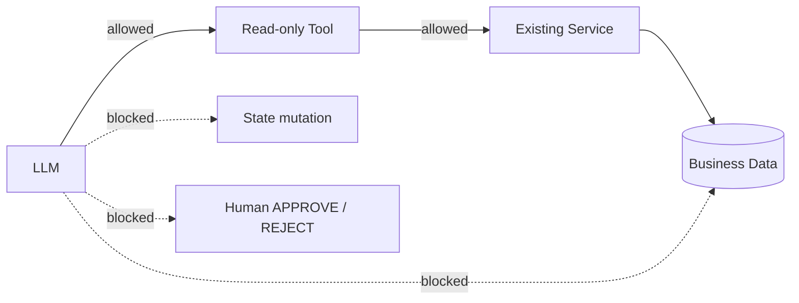
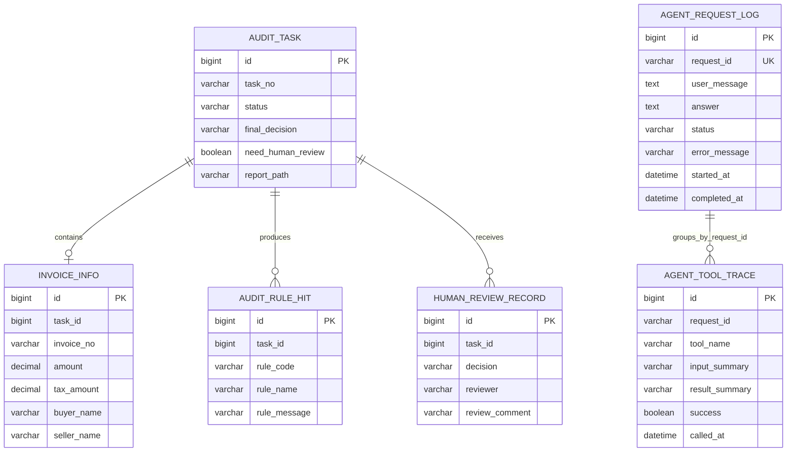
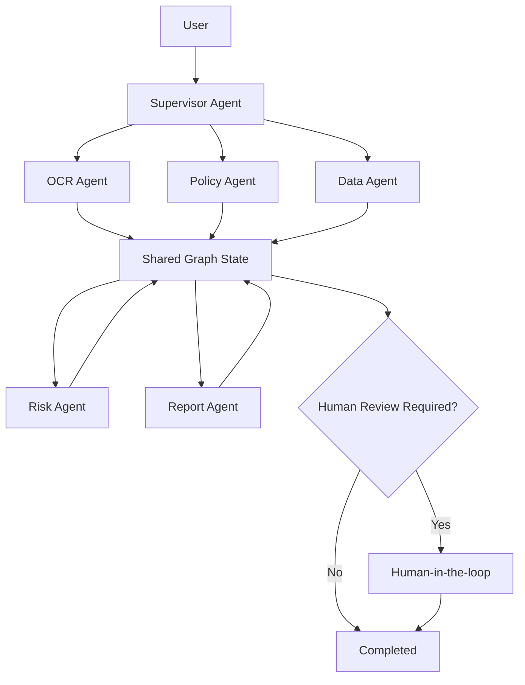

# Intelligent Invoice Reimbursement Audit Multi-Agent System

An intelligent invoice audit backend built with Spring Boot, MyBatis, MySQL, Baidu VAT Invoice OCR, and Spring AI.

The project deliberately separates **deterministic business execution** from **LLM orchestration**. OCR, audit rules, state transitions, transactions, report generation, and Human-in-the-loop remain inside the reliable Java Workflow. The Supervisor Agent is responsible for understanding natural-language requests, selecting read-only Business Tools, and explaining results based on real backend data.

The current Agent stage has advanced from simple in-memory Tool Trace to a queryable request-level execution history.

---

## 1. Current Stage

As of 2026-09-25, the project has evolved through the following path:

```text
Basic invoice CRUD
        ↓
Real Baidu OCR
        ↓
Deterministic audit rules
        ↓
State-driven Workflow
        ↓
Transaction boundary refactor
        ↓
Human-in-the-loop closed loop
        ↓
Supervisor Agent + read-only Business Tools v0.1
        ↓
requestId + persistent Tool Trace v0.2
        ↓
Queryable Agent Request Lifecycle v0.3   ← CURRENT
        ↓
Supervisor model-routing verification
        ↓
Controlled write Tools
        ↓
Multi-Agent Graph
```

| Module | Current Status | Description |
|---|---:|---|
| File upload and task creation | Completed | Stores original files and creates audit tasks |
| Real Baidu OCR | Completed and verified | Parses invoice fields and stores raw OCR JSON |
| Deterministic audit rules | Completed and verified | Required-field, amount-limit, duplicate-invoice checks |
| Audit report | Completed | Generates UTF-8 TXT reports |
| Task center API | Completed | Pagination, filtering, detail, invoice, rule, report queries |
| Human review | Completed | APPROVE / REJECT, persists review record, regenerates final report |
| Business state machine | Completed | Legal transitions, terminal states, stale-state protection |
| Transaction boundaries | Completed | Independent task creation / processing / failure recovery |
| Spring AI integration | Completed v0.1 | Spring AI 1.1.8 on Spring Boot 3.5.x |
| Supervisor Agent | Completed v0.1 | Natural-language entry and Tool selection capability |
| Read-only Business Tools | Completed v0.1 | Five Tools reuse existing `AuditTaskService` methods |
| requestId | Completed v0.2 | Every enabled Supervisor request gets a unique `AGT-*` ID |
| Tool Trace persistence | Completed v0.2 | Tool calls persist to `agent_tool_trace` |
| Agent request lifecycle | Completed v0.3 | `RUNNING -> COMPLETED / FAILED` persisted in `agent_request_log` |
| Trace replay/query API | Completed v0.3 | Query one Agent request and all Tool calls by `requestId` |
| Tool contract automated test | Completed v0.3 | Verifies the five `@Tool` definitions exposed to Spring AI |
| Agent request lifecycle tests | Completed v0.3 | Covers completed and failed request persistence contracts |
| Backend CI definition | Added | GitHub Actions compiles and tests backend on relevant PR/push events |
| Real model-routing automated verification | Next | Verify different prompts cause the expected model-selected Tool calls |
| Controlled write Tools | Not implemented | Requires confirmation, authorization, idempotency, audit boundaries |
| Multi-Agent Graph | Not implemented | Will be introduced only after single-Supervisor behavior is stable |

---

## 2. How to Visualize the Whole System

The system now has **three clearly separated layers**.



Mental model:

```text
Supervisor = dispatcher
Business Tool = controlled phone extension
Service = department that actually knows the business
Workflow = production line
State Machine = gatekeeper
MySQL business tables = source of truth
requestId = case number
agent_request_log = case cover sheet
agent_tool_trace = detailed call record
```

The Agent layer may **ask**, **select**, and **explain**.

The deterministic layer still decides how real business state changes.

---

## 3. Deterministic Invoice Audit Business Flow

The original audit Workflow remains the business backbone even after the Agent layer is enabled.

```mermaid
flowchart TD
    A[POST invoice upload] --> B[Save original file]
    B --> C[createTask()]
    C --> C1[UPLOADED]
    C1 --> D[markOcrProcessing()]
    D --> D1[OCR_PROCESSING]
    D1 --> E[OcrService OCR]
    E --> F[Save InvoiceInfo]
    F --> G[markOcrDone()]
    G --> G1[OCR_DONE]
    G1 --> H[AuditRuleService.checkRules()]
    H --> I{Any risk rule hit?}

    I -->|No| J[finalDecision = APPROVED]
    J --> K[COMPLETED]

    I -->|Yes| L[finalDecision = NEED_HUMAN_REVIEW]
    L --> M[AUDIT_DONE]
    M --> N{Human review}
    N -->|APPROVE| O[APPROVED_BY_HUMAN]
    N -->|REJECT| P[REJECTED_BY_HUMAN]
    O --> Q[COMPLETED]
    P --> Q

    E -->|exception| X[Rollback Core transaction]
    H -->|exception| X
    X --> Y[markFailed() in independent transaction]
    Y --> Z[FAILED]
```

The key engineering rule is:

```text
LLM does not replace this Workflow.
LLM does not directly update audit_task.
LLM does not directly APPROVE or REJECT a reimbursement.
```

---

## 4. Business State Machine

Business task state is centrally restricted by `AuditTaskStateMachine`.


`COMPLETED` and `FAILED` are terminal business states.

State updates also check the previous state at SQL level:

```sql
UPDATE audit_task
SET status = #{targetStatus},
    updated_at = NOW()
WHERE id = #{id}
  AND status = #{currentStatus};
```

This means an old concurrent request cannot silently overwrite a newer state.

```text
Request A reads AUDIT_DONE
        │
Request B changes AUDIT_DONE -> COMPLETED
        │
Request A still tries AUDIT_DONE -> COMPLETED
        ↓
SQL WHERE status = AUDIT_DONE matches 0 rows
        ↓
Illegal stale overwrite is rejected
```

---

## 5. Agent Request State Machine

Agent requests now have their **own lifecycle**, separate from invoice business status.



This state machine describes **Agent execution**, not invoice approval state.

The two state domains must not be confused:

```text
Invoice business state
UPLOADED / OCR_PROCESSING / OCR_DONE / AUDIT_DONE / COMPLETED / FAILED

Agent request state
RUNNING / COMPLETED / FAILED
```

Example:

```text
Invoice task #6 = AUDIT_DONE
Agent request AGT-xxx = COMPLETED
```

This simply means the Agent successfully answered a question about an invoice that is still waiting for human review.

---

## 6. Agent Package Structure

```text
invoice_agent_backend/
├── agent/
│   ├── model/
│   │   ├── SupervisorAgentRequest.java
│   │   ├── SupervisorAgentResponse.java
│   │   └── AgentRequestTraceResult.java
│   │
│   ├── supervisor/
│   │   ├── SupervisorAgentService.java
│   │   └── impl/
│   │       ├── SpringAiSupervisorAgentService.java
│   │       └── DisabledSupervisorAgentService.java
│   │
│   ├── tool/
│   │   └── InvoiceAuditAgentTools.java
│   │
│   └── trace/
│       ├── AgentToolTrace.java
│       ├── AgentToolTraceContext.java
│       ├── AgentRequestRecord.java
│       ├── AgentRequestLogService.java
│       └── impl/
│           └── AgentRequestLogServiceImpl.java
│
├── controller/
│   └── SupervisorAgentController.java
│
└── mapper/
    ├── AgentToolTraceMapper.java
    └── AgentRequestLogMapper.java
```

MyBatis XML:

```text
src/main/resources/mapper/
├── AgentToolTraceMapper.xml
└── AgentRequestLogMapper.xml
```

Tests:

```text
src/test/java/invoice_agent_backend/agent/
├── tool/
│   ├── InvoiceAuditAgentToolsTest.java
│   └── InvoiceAuditAgentToolCatalogTest.java
└── trace/
    └── AgentRequestLogServiceTest.java
```

---

## 7. Supervisor Request: Code-Level Runtime Flow

Suppose the user sends:

```text
Why does task 6 require human review?
```

The runtime chain is:



The most important method chain is:

```text
SupervisorAgentController.askSupervisor()
        ↓
SpringAiSupervisorAgentService.ask()
        ↓
newRequestId()
        ↓
AgentToolTraceContext.start(requestId)
        ↓
AgentRequestLogService.start(requestId, message)
        ↓
ChatClient.prompt().user(...).call().content()
        ↓
InvoiceAuditAgentTools.<selectedTool>()
        ↓
AuditTaskService.<businessMethod>()
        ↓
Mapper / MySQL
        ↓
AgentToolTraceContext.recordSuccess() / recordFailure()
        ↓
AgentToolTraceMapper.insertAgentToolTrace()
        ↓
AgentRequestLogService.complete() / fail()
        ↓
SupervisorAgentResponse
```

---

## 8. Failure Interaction Flow

If the LLM request or Tool chain fails, business data must not be silently changed.



Observability persistence is intentionally **best-effort**.

If `agent_request_log` or `agent_tool_trace` temporarily fails to write:

```text
Trace persistence failure
        ↓
log.warn(...)
        ↓
Do NOT convert a valid read-only business query into a business failure
```

This prevents the monitoring layer from becoming a new single point of failure for the invoice system.

---

## 9. Current Business Tools

The Supervisor currently receives five read-only Tools.

| Tool | Main Purpose | Existing Backend Method |
|---|---|---|
| `getTaskDetailTool` | Full task summary | `AuditTaskService.getTaskDetail(taskId)` |
| `getInvoiceInfoTool` | Invoice fields | `AuditTaskService.getInvoiceInfoByTaskId(taskId)` |
| `getRuleHitsTool` | Explain risk rule hits | `AuditTaskService.getRuleHitsByTaskId(taskId)` |
| `getAuditReportTool` | Read generated report | `AuditTaskService.getReportByTaskId(taskId)` |
| `listTasksByStatusTool` | Query recent tasks by status | `AuditTaskService.getTaskPage(status, 1, 20)` |

Tool execution example:

```text
getRuleHitsTool(6)
        ↓
inputSummary = taskId=6
        ↓
AuditTaskService.getRuleHitsByTaskId(6)
        ↓
AuditRuleHitMapper.selectRuleHitsByTaskId(6)
        ↓
real audit_rule_hit rows
        ↓
buildRuleHitSummary(...)
        ↓
recordSuccess(
    "getRuleHitsTool",
    "taskId=6",
    "ruleHitCount=..."
)
```

The Tool returns a compact business summary to the model instead of dumping raw database objects or OCR JSON.

---

## 10. Tool Contract Verification

`InvoiceAuditAgentToolCatalogTest` converts `InvoiceAuditAgentTools` into Spring AI `ToolCallback` definitions using:

```java
ToolCallbacks.from(tools)
```

The test verifies that Spring AI can discover exactly these five names:

```text
getTaskDetailTool
getInvoiceInfoTool
getRuleHitsTool
getAuditReportTool
listTasksByStatusTool
```

It also verifies that every Tool has:

```text
non-empty description
+
non-empty input schema
```

Why this matters:

```text
Java method exists
    ≠
LLM can see a valid Tool contract
```

The model receives the generated Tool name, description, and JSON input schema. If these contracts are wrong, Tool Calling can fail even when the Java business method itself is correct.

This test verifies the **Tool contract layer**.

It does **not yet prove** that a real model will always select the intended Tool for every natural-language prompt. That is the next integration-verification step.

---

## 11. requestId and Trace Persistence

Each enabled Supervisor request receives:

```text
AGT-<UUID>
```

Example:

```text
AGT-f5f1260d-xxxx-xxxx-xxxx-xxxxxxxxxxxx
```

One requestId may own multiple Tool calls:

```text
AGT-001
│
├── getTaskDetailTool(taskId=6)
│
├── getRuleHitsTool(taskId=6)
│
└── final Supervisor answer
```

This creates a real execution chain instead of isolated log lines.

---

## 12. Querying a Previous Agent Execution

New API:

```text
GET /api/agent/requests/{requestId}
```

Code path:



Conceptually the response is:

```json
{
  "request": {
    "requestId": "AGT-...",
    "userMessage": "Why does task 6 require human review?",
    "answer": "...",
    "status": "COMPLETED",
    "startedAt": "...",
    "completedAt": "..."
  },
  "toolTraces": [
    {
      "requestId": "AGT-...",
      "toolName": "getTaskDetailTool",
      "inputSummary": "taskId=6",
      "resultSummary": "taskId=6, status=AUDIT_DONE, ...",
      "success": true,
      "calledAt": "..."
    }
  ]
}
```

This becomes the backend foundation for a future frontend execution timeline.

---

## 13. Agent Safety Boundary

The current Agent can:

```text
understand a question
select a read-only Tool
query real business data
explain deterministic results
record its own execution trail
```

It cannot directly:

```text
APPROVE an invoice
REJECT an invoice
change audit_task.status
rerun OCR
execute arbitrary SQL
bypass AuditTaskStateMachine
```

The current permission boundary is therefore:



This limits early Agent mistakes to the explanation/orchestration layer instead of allowing them to corrupt reimbursement state.

---

## 14. Persistence Model



`agent_request_log` and `agent_tool_trace` are logically linked by `request_id`.

A hard foreign key is intentionally not required at this stage because Trace persistence is best-effort: observability problems should not make a valid business read fail.

---

## 15. API Surface

### Original Business API

| Method | Path | Purpose |
|---|---|---|
| GET | `/health` | Health check |
| POST | `/api/invoices/upload` | Upload invoice and execute full audit Workflow |
| GET | `/api/invoices/tasks` | Query tasks with pagination |
| GET | `/api/invoices/tasks/{id}` | Query one task |
| GET | `/api/invoices/tasks/{id}/invoice-info` | Query parsed invoice fields |
| GET | `/api/invoices/tasks/{id}/rule-hits` | Query matched rules |
| GET | `/api/invoices/tasks/{id}/report` | Query audit report |
| GET | `/api/invoices/tasks/{id}/detail` | Query aggregated task detail |
| POST | `/api/invoices/tasks/{id}/human-review` | Human APPROVE / REJECT |

### Agent API

Start a Supervisor request:

```text
POST /api/agent/supervisor
```

Request:

```json
{
  "message": "Why does task 6 require human review?"
}
```

Response includes:

```text
requestId
answer
toolTraces
```

Replay/query a previous Agent request:

```text
GET /api/agent/requests/{requestId}
```

---

## 16. Spring AI Configuration

The project currently uses:

```text
Java 17
Spring Boot 3.5.16
Spring AI 1.1.8
OpenAI-compatible Chat Model API
```

The Agent is disabled by default:

```properties
agent.supervisor.enabled=${AGENT_SUPERVISOR_ENABLED:false}
spring.ai.model.chat=${SPRING_AI_MODEL_CHAT:none}
```

Therefore the deterministic invoice backend can still start without an LLM key.

DeepSeek example:

```powershell
$env:AGENT_SUPERVISOR_ENABLED="true"
$env:SPRING_AI_MODEL_CHAT="openai"
$env:LLM_API_KEY="Your model API Key"
$env:LLM_BASE_URL="https://api.deepseek.com"
$env:LLM_MODEL="deepseek-flash"
```

No real API key should be committed to Git.

---

## 17. Automated Verification and CI

Current Agent tests include:

```text
InvoiceAuditAgentToolsTest
        ↓
verifies business Tool output + Tool Trace recording

InvoiceAuditAgentToolCatalogTest
        ↓
verifies Spring AI Tool names / descriptions / input schemas

AgentRequestLogServiceTest
        ↓
verifies request lifecycle persistence contract
        ↓
verifies COMPLETED and FAILED update paths
        ↓
verifies request + Tool Trace aggregation by requestId
```

A GitHub Actions workflow has also been added:

```text
.github/workflows/backend-ci.yml
```

Trigger scope:

```text
Pull Request touching backend/sql/CI
        ↓
Java 17
        ↓
MySQL 8.4 service
Redis 7 service
        ↓
./mvnw -B clean test
```

The Agent is explicitly disabled during CI:

```text
AGENT_SUPERVISOR_ENABLED=false
SPRING_AI_MODEL_CHAT=none
```

This means normal compile/unit tests do not consume an LLM API key.

The CI definition is now in the repository; a successful workflow run still needs to be observed before claiming CI execution has been fully verified.

---

## 18. Why the Agent Does Not Replace the Existing Workflow

A rule engine and an Agent solve different problems.

```text
Deterministic Java code
Best for:
- amount thresholds
- duplicate checks
- required fields
- state transitions
- transaction guarantees
- approval boundaries

LLM / Agent
Best for:
- natural-language intent
- dynamic Tool selection
- explanation
- summarization
- future policy interpretation
- future multi-step orchestration
```

So the architecture is intentionally:

```text
Reliable business capabilities
        ↓
Expose safe Tools
        ↓
Supervisor orchestrates Tools
        ↓
Persist execution evidence
        ↓
Verify behavior
        ↓
Only then introduce more autonomy
```

---

## 19. What Is Still Missing Before Multi-Agent

The project should not immediately create:

```text
OcrAgent.java
PolicyAgent.java
RiskAgent.java
ReportAgent.java
```

The single Supervisor should first become fully reliable.

Recommended order from the current point:

```text
CURRENT
Queryable request lifecycle + persistent Tool Trace
        ↓
1. Observe first green CI run
        ↓
2. Add model-routing integration test
   prompt -> expected Tool call
        ↓
3. Add Tool execution duration / richer metrics
        ↓
4. Add authentication and Tool-level authorization
        ↓
5. Add one controlled write Tool
   explicit confirmation + idempotency + audit
        ↓
6. Add retry / timeout / failure recovery policies
        ↓
7. Introduce Graph State
        ↓
8. Split selected responsibilities into Multi-Agent nodes
```

---

## 20. Future Multi-Agent Graph

Only after the Supervisor + Tool layer is stable should the system evolve toward:



At that point the real engineering focus is not the number of Agent classes. It is:

- conditional routing;
- shared Graph State;
- retry and timeout;
- state recovery;
- Tool permission boundaries;
- Human-in-the-loop interrupts;
- request-level traceability;
- deterministic business invariants;
- frontend execution-chain visualization.

---

## 21. Current Project Positioning

The accurate project description today is:

> A state-driven intelligent invoice reimbursement audit backend built with Spring Boot, MyBatis, MySQL, real Baidu OCR, and Spring AI. It combines a deterministic audit Workflow and state machine with a read-only Supervisor Agent, Business Tool Calling, request-level lifecycle persistence, and queryable Tool Trace, while keeping real approval and state mutation behind explicit deterministic boundaries.

In short:

```text
Not just CRUD
        ↓
Not an LLM wrapper
        ↓
Not yet a complete Multi-Agent product
        ↓
A reliable backend + observable Agent orchestration foundation
```
