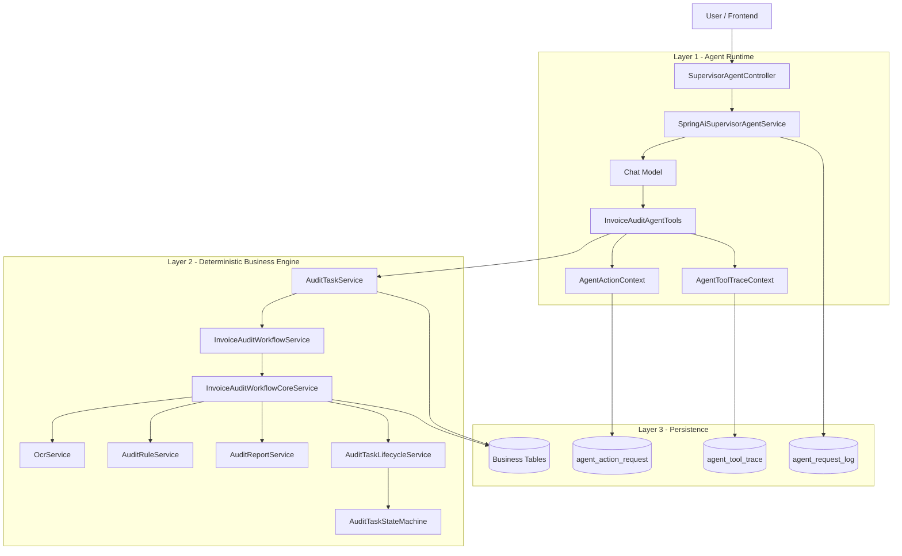
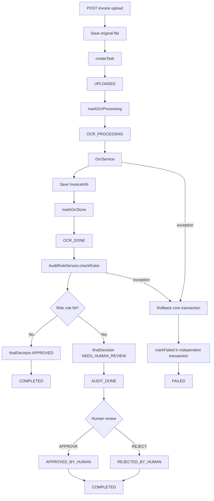
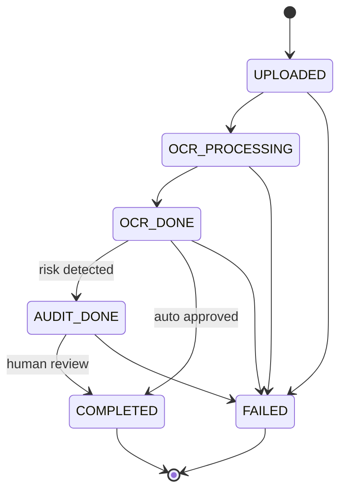
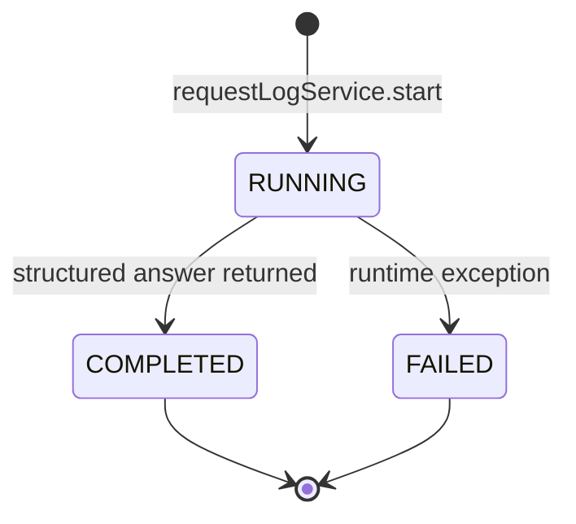
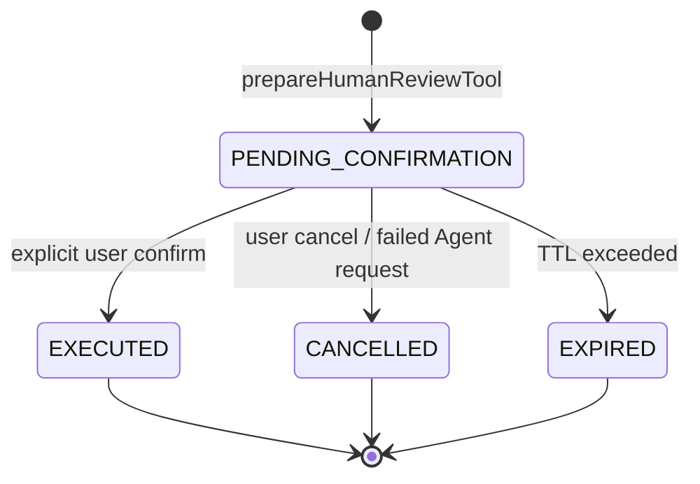
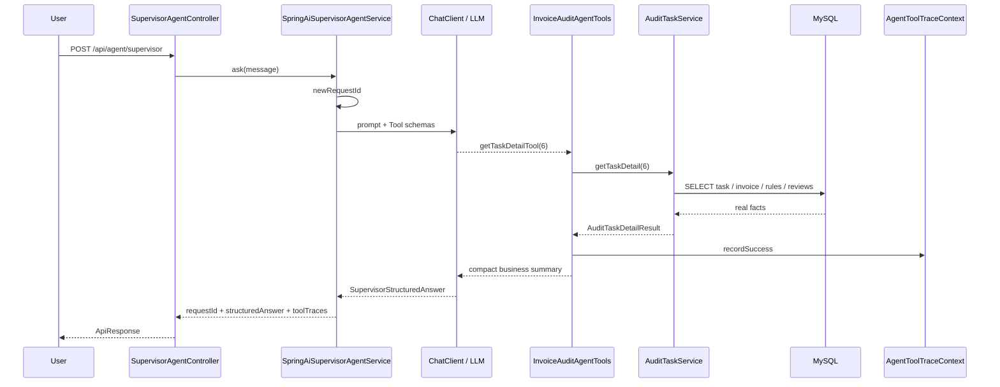
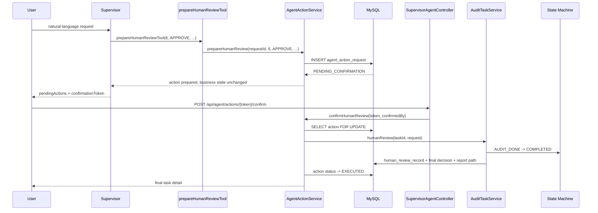
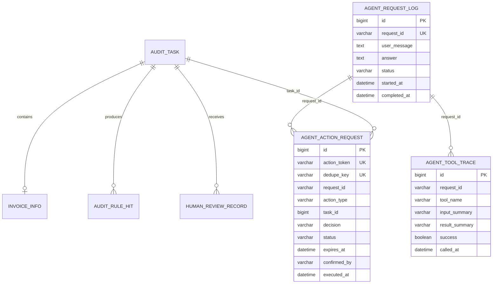
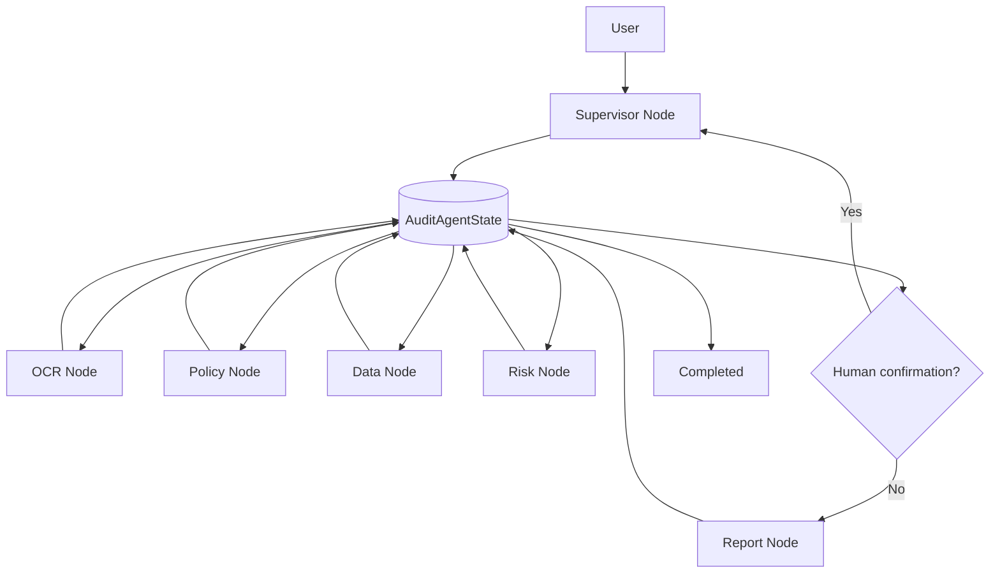

# Intelligent Invoice Reimbursement Audit Multi-Agent System

An intelligent invoice audit backend built with Spring Boot, MyBatis, MySQL, Baidu VAT Invoice OCR, Spring AI, and a deterministic state-driven audit Workflow.

The central design rule is unchanged:

```text
LLM decides what it wants to ask / prepare
        ↓
Java decides what is actually allowed to happen
        ↓
Workflow + State Machine + Transaction remain authoritative
```

The project has now entered **Agent Runtime v1.0**: the Supervisor can return typed structured output and can prepare a controlled business action, but any real APPROVE / REJECT still requires a separate explicit user confirmation.

---

## 1. Current Stage

```text
Basic invoice CRUD
        ↓
Real Baidu OCR
        ↓
Deterministic audit rules
        ↓
State-driven Workflow
        ↓
Transaction boundary refactor
        ↓
Human-in-the-loop closed loop
        ↓
Supervisor + 5 read-only Business Tools v0.1
        ↓
requestId + persistent Tool Trace v0.2
        ↓
Queryable Agent Request Lifecycle v0.3
        ↓
Structured Output + confirmation-gated action runtime v1.0   ← CURRENT
        ↓
Graph State / Multi-Agent
```

| Module | Status | What it means |
|---|---:|---|
| File upload / task creation | Completed | File stored, task created |
| Real Baidu OCR | Completed | Real invoice fields + raw OCR JSON |
| Deterministic rules | Completed | Required field, amount limit, duplicate invoice |
| Business state machine | Completed | Legal transitions + terminal-state protection |
| Transaction boundaries | Completed | Core rollback + independent failure lifecycle |
| Human review | Completed | APPROVE / REJECT through existing business service |
| Audit report | Completed | UTF-8 TXT report generation |
| Supervisor Agent | Completed v1.0 | Natural-language orchestration entry |
| Read-only Tools | Completed | Five query Tools reuse `AuditTaskService` |
| Structured Output | Completed v1.0 | Model output maps to `SupervisorStructuredAnswer` |
| requestId / Tool Trace | Completed | Request-level persistent observability |
| Trace Replay API | Completed | Query one Agent execution by `requestId` |
| Controlled action prepare Tool | Completed v1.0 | Creates `PENDING_CONFIRMATION`, no business mutation |
| Confirmation gate | Completed v1.0 | Explicit token round-trip before business write |
| Action idempotency | Completed v1.0 | Row lock + status check prevent double execution |
| Action expiry / cancel | Completed v1.0 | Pending actions expire or can be cancelled |
| LLM timeout / bounded retry | Completed v1.0 | Remote call timeout + finite retry policy |
| Backend CI | Verified | Java 17 + MySQL + Redis + `mvnw clean test` |
| Live provider routing verification | Not claimed yet | Requires a real model key at runtime |
| Authentication / real user identity | Not implemented yet | `confirmedBy` is still request data |
| Multi-Agent Graph | Not implemented yet | Next major stage |

---

## 2. Whole-System Mental Model

Think of the backend as three stacked systems.


```mermaid
flowchart TB
    U[User / Frontend]

    subgraph A[Layer 1 - Agent Runtime]
        AC[SupervisorAgentController]
        SA[SpringAiSupervisorAgentService]
        LLM[Chat Model]
        TOOLS[InvoiceAuditAgentTools]
        ACTX[AgentActionContext]
        TRACE[AgentToolTraceContext]
    end

    subgraph B[Layer 2 - Deterministic Business Engine]
        ATS[AuditTaskService]
        WF[InvoiceAuditWorkflowService]
        CORE[InvoiceAuditWorkflowCoreService]
        LIFE[AuditTaskLifecycleService]
        SM[AuditTaskStateMachine]
        OCR[OcrService]
        RULE[AuditRuleService]
        REPORT[AuditReportService]
    end

    subgraph C[Layer 3 - Persistence]
        BT[(Business Tables)]
        REQ[(agent_request_log)]
        TT[(agent_tool_trace)]
        AA[(agent_action_request)]
    end

    U --> AC
    AC --> SA
    SA --> LLM
    LLM --> TOOLS

    TOOLS --> ATS
    TOOLS --> ACTX
    TOOLS --> TRACE

    ATS --> WF
    WF --> CORE
    CORE --> OCR
    CORE --> RULE
    CORE --> REPORT
    CORE --> LIFE
    LIFE --> SM

    ATS --> BT
    CORE --> BT

    SA --> REQ
    TRACE --> TT
    ACTX --> AA
```

Memory analogy:

```text
Supervisor          = dispatcher
Tool                = controlled phone extension
AuditTaskService    = real business department
Workflow            = production line
State Machine       = gatekeeper
requestId           = case number
Tool Trace          = call record
confirmationToken   = one-time approval slip
MySQL               = source of truth
```

---

## 3. Deterministic Invoice Audit Flow

The original audit engine still owns the real reimbursement lifecycle.


```mermaid
flowchart TD
    A[POST invoice upload] --> B[Save original file]
    B --> C[createTask]
    C --> S1[UPLOADED]
    S1 --> D[markOcrProcessing]
    D --> S2[OCR_PROCESSING]
    S2 --> E[OcrService]
    E --> F[Save InvoiceInfo]
    F --> G[markOcrDone]
    G --> S3[OCR_DONE]
    S3 --> H[AuditRuleService.checkRules]
    H --> I{Risk rule hit?}

    I -->|No| J[finalDecision APPROVED]
    J --> K[COMPLETED]

    I -->|Yes| L[finalDecision NEED_HUMAN_REVIEW]
    L --> M[AUDIT_DONE]
    M --> N{Human review}
    N -->|APPROVE| O[APPROVED_BY_HUMAN]
    N -->|REJECT| P[REJECTED_BY_HUMAN]
    O --> Q[COMPLETED]
    P --> Q

    E -->|exception| X[Rollback core transaction]
    H -->|exception| X
    X --> Y[markFailed in independent transaction]
    Y --> Z[FAILED]
```

The Agent never replaces this chain.

---

## 4. Business State Machine


```mermaid
stateDiagram-v2
    [*] --> UPLOADED

    UPLOADED --> OCR_PROCESSING
    UPLOADED --> FAILED

    OCR_PROCESSING --> OCR_DONE
    OCR_PROCESSING --> FAILED

    OCR_DONE --> AUDIT_DONE: risk detected
    OCR_DONE --> COMPLETED: auto approved
    OCR_DONE --> FAILED

    AUDIT_DONE --> COMPLETED: human review
    AUDIT_DONE --> FAILED

    COMPLETED --> [*]
    FAILED --> [*]
```

Business writes still pass through `AuditTaskLifecycleService` and `AuditTaskStateMachine`.

SQL also guards the previous state:

```sql
UPDATE audit_task
SET status = #{targetStatus}
WHERE id = #{id}
  AND status = #{currentStatus};
```

So stale concurrent requests cannot silently overwrite a newer state.

---

## 5. Agent Request State Machine

Agent execution state is separate from invoice state.


```mermaid
stateDiagram-v2
    [*] --> RUNNING: requestLogService.start
    RUNNING --> COMPLETED: structured answer returned
    RUNNING --> FAILED: runtime exception
    COMPLETED --> [*]
    FAILED --> [*]
```

Example:

```text
Invoice task #6 = AUDIT_DONE
Agent request AGT-xxx = COMPLETED
```

This only means the Agent request finished. It does not mean the invoice was approved.

---

## 6. Controlled Action State Machine

Agent Runtime v1.0 introduces a third state domain: **pending business actions**.


```mermaid
stateDiagram-v2
    [*] --> PENDING_CONFIRMATION: prepareHumanReviewTool

    PENDING_CONFIRMATION --> EXECUTED: explicit user confirm
    PENDING_CONFIRMATION --> CANCELLED: user cancel / failed Agent request
    PENDING_CONFIRMATION --> EXPIRED: TTL exceeded

    EXECUTED --> [*]
    CANCELLED --> [*]
    EXPIRED --> [*]
```

The three state domains are intentionally independent:

```text
Business Task State
UPLOADED / OCR_PROCESSING / OCR_DONE / AUDIT_DONE / COMPLETED / FAILED

Agent Request State
RUNNING / COMPLETED / FAILED

Agent Action State
PENDING_CONFIRMATION / EXECUTED / CANCELLED / EXPIRED
```

---

## 7. Current Package Structure

```text
invoice_agent_backend/
├── agent/
│   ├── action/
│   │   ├── AgentActionContext.java
│   │   ├── AgentActionRequestRecord.java
│   │   ├── AgentActionService.java
│   │   └── impl/
│   │       └── AgentActionServiceImpl.java
│   │
│   ├── model/
│   │   ├── SupervisorAgentRequest.java
│   │   ├── SupervisorAgentResponse.java
│   │   ├── SupervisorStructuredAnswer.java
│   │   ├── AgentPendingActionView.java
│   │   ├── AgentActionConfirmRequest.java
│   │   ├── AgentActionExecutionResult.java
│   │   └── AgentRequestTraceResult.java
│   │
│   ├── supervisor/
│   │   ├── SupervisorAgentService.java
│   │   └── impl/
│   │       ├── SpringAiSupervisorAgentService.java
│   │       └── DisabledSupervisorAgentService.java
│   │
│   ├── tool/
│   │   └── InvoiceAuditAgentTools.java
│   │
│   └── trace/
│       ├── AgentToolTrace.java
│       ├── AgentToolTraceContext.java
│       ├── AgentRequestRecord.java
│       ├── AgentRequestLogService.java
│       └── impl/
│           └── AgentRequestLogServiceImpl.java
│
├── controller/
│   └── SupervisorAgentController.java
│
├── workflow/
│   ├── InvoiceAuditWorkflowService.java
│   ├── InvoiceAuditWorkflowCoreService.java
│   └── state/
│       └── AuditTaskStateMachine.java
│
└── mapper/
    ├── AgentRequestLogMapper.java
    ├── AgentToolTraceMapper.java
    └── AgentActionRequestMapper.java
```

MyBatis XML:

```text
src/main/resources/mapper/
├── AgentRequestLogMapper.xml
├── AgentToolTraceMapper.xml
└── AgentActionRequestMapper.xml
```

---

## 8. Supervisor Read Request: Code-Level Flow

User asks:

```text
Why does task 6 require human review?
```


```mermaid
sequenceDiagram
    participant U as User
    participant C as SupervisorAgentController
    participant S as SpringAiSupervisorAgentService
    participant L as ChatClient / LLM
    participant T as InvoiceAuditAgentTools
    participant B as AuditTaskService
    participant DB as MySQL
    participant TR as AgentToolTraceContext

    U->>C: POST /api/agent/supervisor
    C->>S: ask(message)
    S->>S: newRequestId
    S->>L: prompt + Tool schemas
    L-->>T: getTaskDetailTool(6)
    T->>B: getTaskDetail(6)
    B->>DB: SELECT task / invoice / rules / reviews
    DB-->>B: real facts
    B-->>T: AuditTaskDetailResult
    T->>TR: recordSuccess
    T-->>L: compact business summary
    L-->>S: SupervisorStructuredAnswer
    S-->>C: requestId + structuredAnswer + toolTraces
    C-->>U: ApiResponse
```

Important method chain:

```text
SupervisorAgentController.askSupervisor()
        ↓
SpringAiSupervisorAgentService.ask()
        ↓
ChatClient.prompt().user(...).call()
        ↓
.entity(SupervisorStructuredAnswer.class)
        ↓
InvoiceAuditAgentTools.<selectedTool>()
        ↓
AuditTaskService.<businessMethod>()
        ↓
Mapper / MySQL
        ↓
AgentToolTraceContext.recordSuccess / recordFailure
```

---

## 9. Structured Output

The model no longer returns only free-form text.

Runtime target type:

```text
SupervisorStructuredAnswer
├── intent
├── summary
├── riskLevel
├── evidence[]
└── nextAction
```

Example shape:

```json
{
  "intent": "EXPLAIN_REVIEW_REASON",
  "summary": "Task 6 requires human review because it matched a risk rule.",
  "riskLevel": "HIGH",
  "evidence": [
    "task status is AUDIT_DONE",
    "needHumanReview is true",
    "rule hit amount_limit"
  ],
  "nextAction": "A human reviewer should inspect the task before final approval."
}
```

Java applies another validation layer after model output:

```text
summary must exist
riskLevel ∈ UNKNOWN / LOW / MEDIUM / HIGH
evidence max 10 items
field lengths are bounded
invalid riskLevel -> UNKNOWN
```

So downstream code receives typed data instead of parsing arbitrary prose.

---

## 10. Current Agent Tools

| Tool | Type | Purpose |
|---|---|---|
| `getTaskDetailTool` | Read-only | Complete task summary |
| `getInvoiceInfoTool` | Read-only | Parsed invoice fields |
| `getRuleHitsTool` | Read-only | Explain matched risk rules |
| `getAuditReportTool` | Read-only | Read generated report |
| `listTasksByStatusTool` | Read-only | Query recent tasks by status |
| `prepareHumanReviewTool` | Controlled prepare | Prepare APPROVE / REJECT action only |

The sixth Tool is deliberately **not** a direct write Tool.

```text
prepareHumanReviewTool
        ↓
validate task = AUDIT_DONE
        ↓
validate needHumanReview = true
        ↓
validate decision = APPROVE / REJECT
        ↓
INSERT agent_action_request
        ↓
status = PENDING_CONFIRMATION
        ↓
STOP
```

No `audit_task` state changes here.

---

## 11. Human Confirmation Flow

User asks:

```text
Approve task 6 after review.
```

The safe interaction is:


```mermaid
sequenceDiagram
    participant U as User
    participant S as Supervisor
    participant T as prepareHumanReviewTool
    participant AS as AgentActionService
    participant DB as MySQL
    participant C as SupervisorAgentController
    participant BS as AuditTaskService
    participant SM as State Machine

    U->>S: natural-language request
    S->>T: prepareHumanReviewTool(6, APPROVE, ...)
    T->>AS: prepareHumanReview(requestId, 6, APPROVE, ...)
    AS->>DB: INSERT agent_action_request
    DB-->>AS: PENDING_CONFIRMATION
    AS-->>S: action prepared, business state unchanged
    S-->>U: pendingActions + confirmationToken

    U->>C: POST /api/agent/actions/{token}/confirm
    C->>AS: confirmHumanReview(token, confirmedBy)
    AS->>DB: SELECT action FOR UPDATE
    AS->>BS: humanReview(taskId, request)
    BS->>SM: AUDIT_DONE -> COMPLETED
    BS->>DB: human_review_record + final decision + report path
    AS->>DB: action status -> EXECUTED
    AS-->>U: final task detail
```

The decisive boundary is:

```text
LLM
 ↓
prepare action
 ↓
PENDING_CONFIRMATION
 ↓
USER CONFIRMATION
 ↓
AgentActionService
 ↓
AuditTaskService.humanReview
 ↓
State Machine
 ↓
Transaction
 ↓
MySQL
```

---

## 12. Why confirmationToken Is Not Given Back to the Model

`prepareHumanReviewTool` does not return the token in its Tool text result.

Instead:

```text
AgentActionService creates token
        ↓
AgentActionContext stores action in current Java request context
        ↓
Supervisor finishes model reasoning
        ↓
SupervisorAgentResponse.pendingActions
        ↓
Frontend receives confirmationToken directly from Java
```

Reason:

```text
Model should never be responsible for copying,
rewriting, inventing, or choosing a business execution credential.
```

---

## 13. Idempotency and Concurrency

Each prepared action has:

```text
action_token   unique
dedupe_key     unique
request_id
task_id
decision
status
expires_at
```

Preparation dedupe key:

```text
requestId : HUMAN_REVIEW : taskId : decision
```

Confirmation uses:

```sql
SELECT *
FROM agent_action_request
WHERE action_token = #{actionToken}
FOR UPDATE;
```

This means two confirmation requests for the same token are serialized.

```text
Confirm A locks row
        ↓
executes humanReview
        ↓
marks action EXECUTED
        ↓
commit
        ↓
Confirm B obtains row lock
        ↓
sees EXECUTED
        ↓
returns existing result
        ↓
DOES NOT call humanReview again
```

So duplicate clicks or repeated HTTP confirmation do not duplicate the business write.

---

## 14. Failure and Expiry Boundaries

### Agent request fails after preparing an action

```text
prepareHumanReviewTool
        ↓
PENDING_CONFIRMATION created
        ↓
LLM / structured-output failure
        ↓
SpringAiSupervisorAgentService catch
        ↓
cancelPendingByRequestId(requestId)
        ↓
CANCELLED
```

This prevents orphan approval actions from surviving a failed Agent response.

### Confirmation expires

Default TTL:

```text
10 minutes
```

Expired token:

```text
PENDING_CONFIRMATION
        ↓
now > expiresAt
        ↓
EXPIRED
        ↓
no humanReview call
```

---

## 15. Remote Model Failure Policy

The runtime bounds remote model behavior with configuration rather than allowing indefinite waits.

```properties
spring.ai.openai.timeout=${LLM_TIMEOUT:30s}
spring.ai.openai.max-retries=0
spring.ai.retry.max-attempts=${LLM_RETRY_MAX_ATTEMPTS:3}
spring.ai.retry.backoff.initial-interval=${LLM_RETRY_INITIAL_INTERVAL:1s}
spring.ai.retry.backoff.multiplier=${LLM_RETRY_MULTIPLIER:2}
spring.ai.retry.backoff.max-interval=${LLM_RETRY_MAX_INTERVAL:5s}
```

Why SDK retries are disabled:

```text
One retry layer is easier to reason about than two nested retry systems.
```

The action `dedupe_key` also prevents repeated preparation inside one Agent request from creating duplicate pending actions.

---

## 16. Persistence Model


```mermaid
erDiagram
    AUDIT_TASK ||--o| INVOICE_INFO : contains
    AUDIT_TASK ||--o{ AUDIT_RULE_HIT : produces
    AUDIT_TASK ||--o{ HUMAN_REVIEW_RECORD : receives

    AGENT_REQUEST_LOG ||--o{ AGENT_TOOL_TRACE : request_id
    AGENT_REQUEST_LOG ||--o{ AGENT_ACTION_REQUEST : request_id
    AUDIT_TASK ||--o{ AGENT_ACTION_REQUEST : task_id

    AGENT_REQUEST_LOG {
        bigint id PK
        varchar request_id UK
        text user_message
        text answer
        varchar status
        datetime started_at
        datetime completed_at
    }

    AGENT_TOOL_TRACE {
        bigint id PK
        varchar request_id
        varchar tool_name
        varchar input_summary
        varchar result_summary
        boolean success
        datetime called_at
    }

    AGENT_ACTION_REQUEST {
        bigint id PK
        varchar action_token UK
        varchar dedupe_key UK
        varchar request_id
        varchar action_type
        bigint task_id
        varchar decision
        varchar status
        datetime expires_at
        varchar confirmed_by
        datetime executed_at
    }
```

---

## 17. Agent API Surface

### Ask Supervisor

```text
POST /api/agent/supervisor
```

Request:

```json
{
  "message": "Why does task 6 require human review?"
}
```

Response now contains:

```text
requestId
answer
structuredAnswer
pendingActions
toolTraces
```

### Replay Agent execution

```text
GET /api/agent/requests/{requestId}
```

### Query pending action

```text
GET /api/agent/actions/{confirmationToken}
```

### Confirm pending action

```text
POST /api/agent/actions/{confirmationToken}/confirm
```

Body:

```json
{
  "confirmedBy": "reviewer-name",
  "comment": "confirmed after checking the invoice"
}
```

### Cancel pending action

```text
POST /api/agent/actions/{confirmationToken}/cancel
```

---

## 18. Runtime Configuration

The deterministic backend still starts without an LLM key.

Default:

```properties
agent.supervisor.enabled=false
agent.action.human-review.enabled=false
spring.ai.model.chat=none
```

Example local Agent configuration:

```powershell
$env:AGENT_SUPERVISOR_ENABLED="true"
$env:SPRING_AI_MODEL_CHAT="openai"
$env:LLM_API_KEY="Your model API Key"
$env:LLM_BASE_URL="https://api.deepseek.com"
$env:LLM_MODEL="deepseek-flash"
```

Enable controlled human-review action separately:

```powershell
$env:AGENT_HUMAN_REVIEW_ACTION_ENABLED="true"
```

No real API key belongs in Git, README, source code, or CI logs.

---

## 19. Automated Verification

Current deterministic Agent tests cover:

```text
InvoiceAuditAgentToolsTest
        ↓
Tool output + Tool Trace

InvoiceAuditAgentToolCatalogTest
        ↓
all 6 Tool contracts are visible to Spring AI

AgentRequestLogServiceTest
        ↓
RUNNING / COMPLETED / FAILED persistence

AgentActionContextTest
        ↓
request-scoped pending action isolation

AgentActionServiceTest
        ↓
prepare without business mutation
        ↓
reject invalid business state
        ↓
explicit confirmation execution
        ↓
idempotent repeated confirmation
        ↓
expired token does not execute write
        ↓
feature flag fails closed
```

CI pipeline:

```text
Pull Request
    ↓
Java 17
    ↓
MySQL 8.4 + Redis 7
    ↓
./mvnw -B clean test
    ↓
GREEN required before merge
```

A real external LLM is deliberately not required by normal CI, so tests do not consume secrets or money.

Live prompt-to-Tool routing still needs a real provider smoke test before claiming provider-specific routing accuracy.

---

## 20. Security Boundary After Runtime v1.0

Allowed:

```text
LLM -> read Tool -> Service -> DB
LLM -> prepareHumanReviewTool -> PENDING_CONFIRMATION
User -> confirmation endpoint -> humanReview -> State Machine -> DB
```

Blocked by design:

```text
LLM -> direct SQL
LLM -> direct audit_task update
LLM -> direct APPROVE
LLM -> direct REJECT
LLM -> bypass state machine
LLM -> reuse expired confirmation token
```

One limitation is still explicit:

```text
confirmedBy is currently supplied by the request.
Real authentication / authorization is not implemented yet.
```

That must be solved before treating the system as a production approval platform.

---

## 21. Why Agent Runtime v1.0 Matters

Before:

```text
User
 ↓
Supervisor
 ↓
Read Tool
 ↓
Explain
```

Now:

```text
User
 ↓
Supervisor
 ↓
Read / reason
 ↓
Structured Output
 ↓
Prepare controlled action
 ↓
Human confirmation boundary
 ↓
Deterministic business execution
 ↓
Traceable final result
```

The Agent has moved from a **query assistant** to a **controlled business executor** without making the LLM the source of truth.

---

## 22. Next Major Stage

The next large phase is **Graph State + real Multi-Agent orchestration**.

Do not start by creating empty classes named `OcrAgent`, `RiskAgent`, or `ReportAgent`.

First introduce one shared state object:

```text
AuditAgentState
├── requestId
├── taskId
├── invoiceInfo
├── ruleHits
├── policyEvidence
├── riskResult
├── pendingAction
├── humanDecision
└── reportResult
```

Then turn responsibilities into real Graph nodes:


```mermaid
flowchart TD
    U[User]
    S[Supervisor Node]
    STATE[(AuditAgentState)]
    OCR[OCR Node]
    POLICY[Policy Node]
    DATA[Data Node]
    RISK[Risk Node]
    HUMAN{Human confirmation?}
    REPORT[Report Node]
    DONE[Completed]

    U --> S
    S --> STATE

    STATE --> OCR
    STATE --> POLICY
    STATE --> DATA

    OCR --> STATE
    POLICY --> STATE
    DATA --> STATE

    STATE --> RISK
    RISK --> STATE

    STATE --> HUMAN
    HUMAN -->|No| REPORT
    HUMAN -->|Yes| S

    REPORT --> STATE
    STATE --> DONE
```

The engineering targets of that phase are:

- shared Graph State;
- conditional routing;
- node-level retry / timeout;
- checkpoint / resume;
- Human-in-the-loop interrupt and resume;
- Agent-level Tool permission boundaries;
- later Policy RAG;
- evaluation of routing and final-answer quality.

---

## 23. Current Project Positioning

The accurate description after Runtime v1.0 is:

> A state-driven intelligent invoice reimbursement audit backend built with Spring Boot, MyBatis, MySQL, real Baidu OCR, and Spring AI. It combines a deterministic audit Workflow and state machine with a Supervisor Agent that supports typed structured output, persistent request/Tool tracing, and confirmation-gated business actions. The LLM can prepare an operation but cannot directly mutate reimbursement state; final writes still pass through the existing Human-in-the-loop service, transaction boundary, and state machine.

In short:

```text
Not just CRUD
        ↓
Not an LLM wrapper
        ↓
Not yet a full Multi-Agent Graph
        ↓
A controlled, observable, executable Agent Runtime
```
